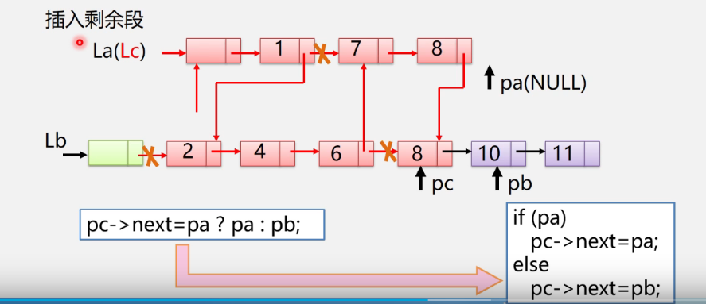
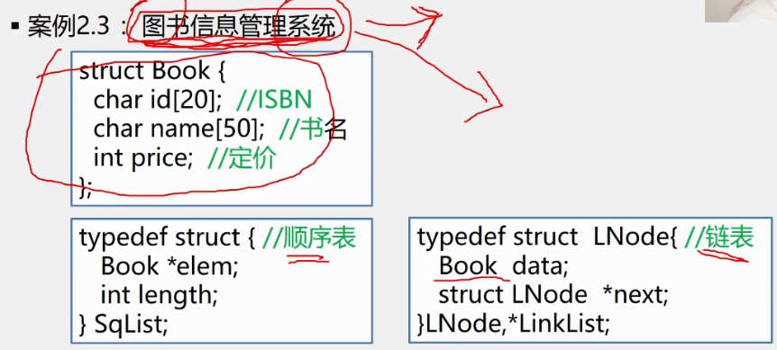
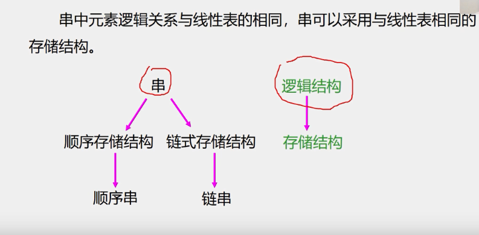
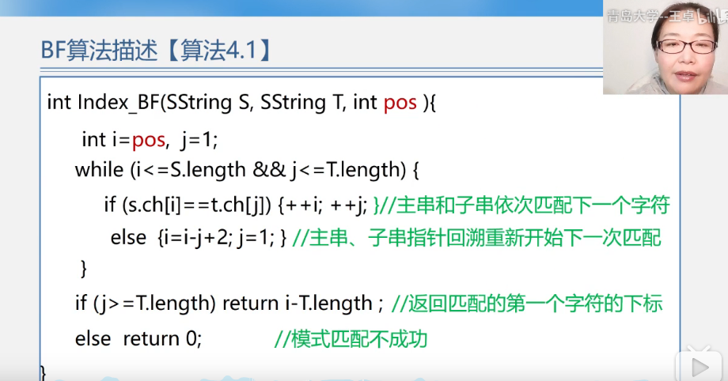
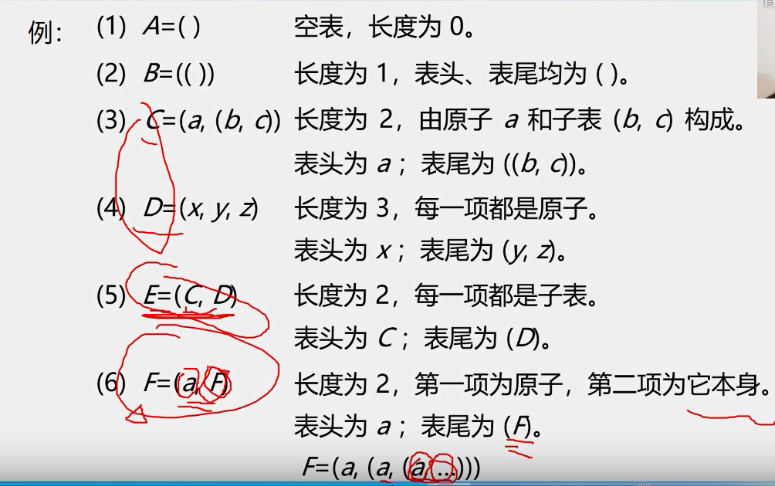
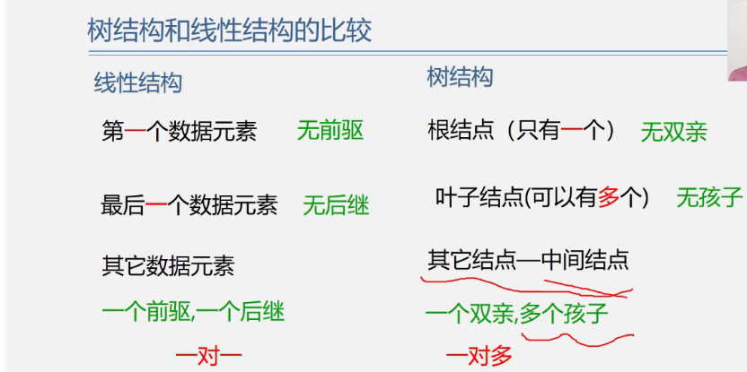
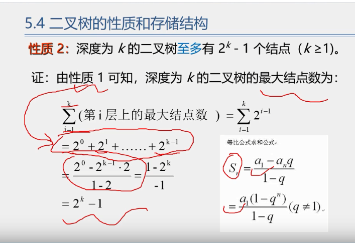
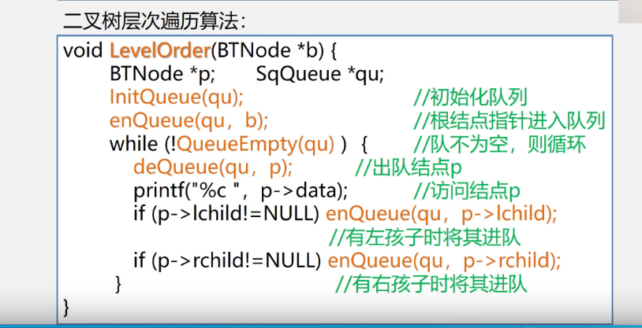

`一、数据基本信息`

`1、数据、数据元素、数据项和数据对象`
  a、数据 
     .是能输入计算机且能被计算机处理的各种符合的集合
       * 信息的载体
       * 是对客观事物符号化的表示
       * 能够被计算机识别、存储和加工
     
     .包括:
       * 数值型的数据:整数、实数等
       * 非数值型的数据:文字、图像、图形、声音等
     
  b、数据元素
     . 是数据的基本单位，在计算机程序中通常作为一个整体进行考虑和处理      
     . 也简称为元素，或称为记录，结点或顶点。 
     . 一个数据元素可由若干数据项组成
     
  c、数据项
     . 构成数据元素的不可分割的最小单位。
     
  d、数据对象
     . 是性质相同的数据元素的集合，是数据的一个子集。   
     
  e、数据类型
     例如C语言中:
   * 提供 int、char、float、double等基本数据类型
   * 数组、结构、共用体、枚举等构造数据类型
   * 还有指针、空（void）类型
   * 用户还可以用typedef来自己定义数据类型  
     
`2、什么是数据结构`
   a、数据元素不是孤立存在的，它们之间存在着某种关系，数据元素相互之间的关系成为结构
  
   b、是指相互之间存在一种或多种特定关系的数据元素集合
  
   c、或者说，数据结构是带结构的数据元素的集合
   
2.1、数据结构包括以下三个方面的内容:
   a、数据元素之间的逻辑关系，也称为逻辑结构
  
   b、数据元素及其关系在计算机内存中的表示（又称为映像），称为数据的物理结构或数据的存储结构。
  
   c、数据的运算和实现，即对数据元素可以施加的操作以及这些操作在想要的存储结构上的实现
2.2 数据结构的两个层次
  a.逻辑结构 
   * 描述数据元素之间的逻辑关系
   * 与数据的存储无关，独立于计算机
   * 是从具体问题抽象出来的数学模型
  b.物理结构（存储结构）
   * 数据元素及其关系在计算机存储器中的结构（存储方式）
   * 是数据结构在计算机中的表示
  c.逻辑结构与存储结构的关系
   * 存储结构是逻辑关系的映像与元素本身的映像。
   * 逻辑结构是数据结构的抽象，存储结构是数据结构的实现
   * 两者综合起来建立了数据元素之间的结构关系。    

2.3、逻辑结构的种类
  划分方式一
    
  1)、线性结构
        有且仅有一个开始和一个终端结点，并且所有结点都最多只有一个直接前趋和一个直接后继
         例如:线性表、栈、队列、串
  
  2)、非线性结构
        一个结点可能有多个直接前趋和直接后继
         例如:树、图           
   
   划分方式二
   * 集合结构:结构中的数据元素之间除了同属于一个集合的关系外，无任何其他关系
   * 线性几个:结构中的数据元素之间存在一对一的线性关系
   * 树形结构:结构中的数据元素之间存在着一对多的层次关系
   * 图状结构或网状结构:结构中的数据元素之间存在着多对的的任意关系。
    
2.4、存储结构的种类
  1)、顺序存储结构
   * 用一组连续的存储单元依次存储数据元素，数据元素之间的逻辑关系由元素的存储位置来表示。
   * C 语言中用数组来实现顺序存储结构
  2)、链式存储结构
   * 用一组任意的存储单元存储数据元素，数据元素之间的逻辑关系用指针来表示。
   * C 语言中用指针（地址）来实现链式存储结构
  3)、索引存储结构
   * 在存储结点信息的同时，还建立附加的索引表。
   * 索引表的每一项称为一个索引项
   * 索引项的一般形式是:（关键字，地址）
   * 关键是能唯一标识一个结点的那些数据项。
  4)、散列存储结构     
   * 根据结点的关键字直接计算出该结点的存储地址
       
2.5 用C语言实现抽象数据类型
```
void assign(Complex *A , float real, float image){
   A ->realpart = real; //实部
   A ->imagepart = imag; // 虚部
 }
 
 void add(Complex *c, Complex A, Complex B){
   c -> realpart = A.realpart + B.realpart;
   c -> imagepart = A.imagepart + B.imagepart;
 }
 注:Complex 是我们定义的一个结构类型
  带*:表示指针变量，他是指向Complex类型的指针
  不带*:Complex类型的普通变量
```     
     
2.6、算法
1)、算法的定义:对特定问题求解方法和步骤的一种描述，它是指令的有限序列，其中每个指令表示一个或多个操作     
2)、算法与程序:
  * 算法是解决问题的一种方法或一个过程，考虑如何将输入转换成输出，一个问题可以有多种算法
  * 程序是用某种程序设计语言对算法的具体实现
3)、算法特性 :一个算法必须具备以下五个重要特性
  * 有穷性:一个算法必须总是在执行有穷步之后结束，且每一步都在有穷时间内完成
  * 确定性:算法中的每一条指令必须有确切的含义，没有二义性，在任何条件下，只有
       唯一的一条执行路径，即对于相同的输入只能得到相同的输出
  * 可行性: 算法是可执行的，算法描述的操作可以通过已经实现的基本操作执行有限次来实现
  * 输入 : 一个算法有零个或多个输入
  * 输出 : 一个算法一个多个多个输出
      
4)、算法设计的要求
  * 正确性（Correctness）
  * 可读性（Readability）
  * 健壮性（Robustness）
  * 高效性（Efficiency）  
  
5)、算法时间复杂度的渐进表示法
  * 为了便于比较不同算法的时间效率，我们仅比较它们的数量级
    例如:两个不同的算法，时间消耗分别是:
      T1(n) = 10n^2 与 T2(n) = 5n^3  
      
6)、若某个辅助函数f(n),使得当n趋近于无穷大时，T(n)/f(n)的极限值为不等于零的常数，
     则称f(n)是T(n)的同数量级函数。记作T(n) =O(f(n)), 称O(f(n))为算法的渐进时间复杂度(O是数量级的符号)，简称时间复杂度。
 ```
例如:对于求解矩阵相乘问题，算法耗费时间:
        T(n) = 2n^3 + 3n^2 + 2n +1
        当n--->无穷大时，T(n)/n^3 -->2,这表示n充分大时，T(n)与n^3是同阶或同数量级，引入大“O”记号，则T(n)可以记作:
            T(n)= O(n^3)  这就是求解矩阵相乘问题的算法的渐进时间复杂度 

 ```  
7)、 一般情况下，不必计算所有操作的执行次数，而只考虑算法中基本操作执行的次数，它是问题规模n的某个函数，用T(n)表示。
     
8)、算法时间复杂度的定义
    *算法中基本语句重复执行的次数是问题规模n的某个函数f(n),算法的时间量度记作:T(n)=O(f(n))
      a、算法中重复执行次数和算法的执行时间成正比的语句
      b、对算法运行时间的贡献最大的
      c、执行次数最多的     
      
    对应n 越大算法的执行时间越长
     *排序:n为记录数
     *矩阵:n为矩阵的阶数
     *多项式:n为多项式的项数
     *集合:n为元素个数
     *树:n为树的结点个数
     *图:n为图的顶点数或边数
9)、分析算法时间复杂度的基本方法
    a、找出语句频度最大的那条语句作为基本语句
    b、计算基本语句的频度得到问题规模n的某个函数f(n)
    c、取其数量级用符号“O”表示
```
x=0; y=0;
 for(int k=0;k<n;k++){ // for循环是n+1次，循环体是n次
  x++;
}

```

例2:N*N矩阵相乘
   

算法时间复杂度分析示例
   
  
算法时间复杂度分析例题，示例3
   
    
  
(10) 渐进空间复杂度
  * 空间复杂度:算法所需存储空间的度量， 记作:S(n)=O(f(n))  其中n为问题的规模(或大小)
  * 算法要占用的空间
     a.算法本身要占据的空间，输入/输出，指令，常数，变量等
     b.算法要使用的辅助空间
     
2.7、知识回顾小结
       
     1、数据结构 
      a.数据的逻辑结构
          * 线性结构:
              线性表
              栈(特殊线性表)
              队列
              字符串、数组、广义表
          * 非线性结构:
              树形结构
              图形结构   
      b.数据的存储结构
          * 顺序存储
          * 链式存储
      c.数据的运算  
          * 检索、排序、插入、删除、修改等
          
3、线性表要研究的内容
   a.线性表的定义和特点
  
   b.案例引入
  
   c.线性的类型定义
  
   d.线性表的顺序表示和实现2
  
   e.线性表的链式表示和实现
  
   f.顺序表和链表的比较
  
   g.线性表的应用
  
   h.案例分析与实现
   
3.1线性表的定义和特点
  线性表示具有相同特性的数据元素的一个有限序列 
              
1、线性表(Linear List)
  
   
3.2、案例引入
 案例:一元多项式的运算，实现两个多项式加、减、乘运算  
 
 
 稀疏多项式:存储是就不根据上面的方法来存储了，因为按照那种方式存储会操作空间浪费
  
 稀疏多项式的运算
 
 注意: 稀疏多项式运算
      1、创建一个新的数组c
      2、分别从头遍历比较a和b的每一项
         *指数相同，对应系数相加，若相加不为零，则在c中增加一个新项
         *指数不相同，则将指数较小的项复制到c中
         
 顺序存储结构存在问题
   1、存储空间分配不灵活
   2、运算的空间复杂度高
   
3.3、线性的类型定义
  1、抽象数据类型线性表的定义如下:
   
  
  2、InitList(&L) (Initialization List)
   操作结果:构造一个空的线性表L
  
  3、DestroyList(&L)
   * 初始条件:线性表L已经存在
   * 操作结果:销毁线性表
  
  4、ClearList(&L)
   * 初始条件:线性表L已经存在。
   * 操作结果:将线性表L重置为空表。
 
  5、ListEmpty(L)
   * 初始条件:线性表L已经存在。
   * 操作结果:若线性表L为空表,则返回TRUE;否则返回FALSE。     
  
  6、ListLength(L)
   * 初始条件:线性表L已经存在。
   * 操作结果:返回线性表L中的数据元素个数。  
  
  7、GetElem(L,i,&e)  (加上&表示要返回值)
   * 初始条件:线性表L已经存在,1<=i<=ListLength(l)。
   * 操作结果:用e返回线性表L中第1个数据元素的值。
  
  8、LocateElem(L,e,compare())
   * 初始条件:线性表L已经存在,compare()是数据元素判定函数。
   * 操作结果:返回L中第1个与e满足compare的数据元素的位序,若这样的数据元素不存在则返回值为0。
 
  9、PriorElem(L,cur_e,&pre_e)
   * 初始条件:线性表L已经存在。
   * 操作结果:若cur_e是L的数据元素,且不是第1个，则用pre_e返回它的前趋否则操作失败,pre_e无意义。  
  
  10、NextElem(L,cur_e,&next_e)
   * 初始条件:线性表L已经存在。
   * 操作结果:若cur_e是L的数据元素,且不是最后一个，则用next_e返回它的后继否则操作失败,next_e无意义。
  
  11、ListInsert(&L,i,e)
   * 初始条件:线性表L已经存在,1<=i<=ListLength(L)+1。
   * 操作结果:在L的第i个位置之前插入新的数据元素e,L的长度加1   
  
  12、ListDelete(&L,i,&e)
   * 初始条件:线性表L已经存在,1<=i<=ListLength(L)。
   * 操作结果:删除L的第i个数据元素,并用e返回其值,L的长度减一。   
  
  13、ListTraverse(&L,visited())
   * 初始条件:线性表L已经存在。
   * 操作结果:依次对线性表中每个元素调用visited()。   
 
3.4、线性表的顺序存储表示
   线程表的顺序表示又称为顺序存储结构或顺序映像
   a、顺序存储定义:把逻辑上相邻的数据元素存储在物理上相邻的存储单元中的存储结构


3.4.1、顺序表的顺序存储表示

 定义多项式的结构，然后去计算多项式。


3.5 补充 类c语言的有关操作
 a、对一些问题的补充说明
                                        
 
 b、C语言的内存动态分配
  (Sequence List) 顺序表，下面的SqList L 定义变量，L是SqList这种类型的。
  这个就像 int a; //定义变量a, a是int型。
  SqList L;
   L.data=(ElemType*)malloc(sizeof(ElemType)*MaxSize);  
   这里ElemType*, *表示指针 这里进行了强制类型转换。
  1)、malloc(m)函数，开辟m字节长度的地址空间，并返回这段空间的首地址, 参数要求是整数
  2)、sizeof(x)运算，计算变量x的长度
  3)、free(p)函数，释放指针p所指变量的存储空间，即彻底删除一个变量
  
  这些函数在头文件里面，所以需要加载头文件:<stdlib.h>  
 
3.5.1 C++中参数传递
  1、函数调用时传送给形参表的实参必须与形参三个一致 
     类型、个数、顺序
  
  2、参数传递有两种方式
     * 传值方式(参数为整型、实型，字符型等)
     * 传地址
         参数为指针变量
         参数为引用类型
         参数为数组名 
         
  a、传值方式:把实参的值传送给函数局部工作区相应的副本中，函数使用这个副本执行必要的功能。
  函数修改的是副本的值，实参的值不变。
  
  
  b、传地址方式---指针变量作为参数
  * 形参变化影响实参
    这个指针指向的就是这个参数地址位置
   这里方式是改变指针指向的内容

 
  * 形参变化不影响实参??
   这里只是改变指向，但是不改变指针指向的地址
 
    
    
c、传地址方式--数组名作为参数
  * 传递的是数组的首地址
  * 对形参数组所做的任何改变都将反映到实参数组中

d、传地址方式-- 引用类型做参数
  引用:它用来给一个对象提供一个替代的名字
```
#include<iostream.h>
void main(){
   int i=5;
   int &j=i;
   i=7;
   count<<"i="<<i<<" j="<<j;
}

这里j是一个引用类型，代表i的一个替代名i值改变是，j值也跟着改变，所以会输出i=7 j=7

```       

e、引用类型作为形参的三点说明
 (1).传递引用给函数与传递指针的效果是一样的，形参变化实参也发生变化
 
 (2).引用类型作参数，在内存中并没有产生实参的副本，它直接对实参操作;
    而一般变量作参数，形参与实参就占用不同的存储单元，所以形参变量的值是实参变量的副本。
    因此，当参数传递的数据量较大时，用引用比用一般变量传递参数的时间和空间效率都好    
 
 (3).指针参数虽然也能达到与使用引用的效果，但在被调用函数中需要重复使用
   "*指针变量名(取这个指针变量的内容)"的形式进行运算，这很容易产生错误且程序的阅读性较差;另一方面，
   在主调函数的调用点处，必须用变量的地址作为实参。    
   
3.6线性表的顺序表示和实现
  顺序表示意图
    
  
补充:操作算法中用到的预定义常量和类型
```
//函数结果状态代码
#define TRUE  1
#define FALSE 0
#define OK    1 
#define ERROE 0
#define INFEASIBLE -1
#define OVERFLOW   -2
//Status 是函数类型，其值是函数结果状态代码
typedef int Status;
typedef char ElemType;
```   
3.6.1 顺序表基本操作的实现
 【算法2.1】 线性表L的初始化(参数用引用类型)
```
 //这里参数应的是引用型的，也就是说这里对形参进行操作实际上也对实参进行了操作
 Status InitList_Sq(SqList &L){ // 构造一个空的顺序表L
  L.elem = new ElemType[MAXSIZE]; // 为顺序表发分配空间
  if(!L.elem) exit(OVERFLOW);  //存储分配失败
  L.length=0;                  //空表长度为0
  return OK; 
}
```             
3.7 顺序表上的查找操作
  a.按值查找:按照给定的运算进行查找,从头到尾一个一个的查找
  算法示例: 
  
  
  b. 平均查找长度ASL(Average Search Length)
     *为确定记录在表中的位置，需要与给定值进行比较的关键字的个数的期望值叫做查找算法的凭据查找长度
   平均查找长度公式:  这个公式中大E是累加和，P表示第i个记录被查询的概率
     C表示第i个记录需比较的次数。
     
    
   公式的推导:每个元素的概率提取出来，然后在进行元素相加，这个是等差数列求和。所以最终的公式如图
   
             
3.8、插入算法如果在顺序表上表现出来
 顺序表的插入
 
 算法的实现
 注意:这里的i是位序，不是数组下标
 ``` 
 Status ListInsert_Sq(SqList &L,int i,ElemType e){ // 构造一个空的顺序表L
  if(i<1 || i>L.length+1) return ERROR; //i值不合法 
  if(L.length == MAXSIZE) return ERROR;  //当前存储空间已满
  for(j=L.length-1;j>=i-1;j--){
   L.elem[j+1]=L.elem[j]; //插入位置及之后的元素后移
  }
   L.elem[i-1] = e;      //将新元素e放入第i个位置
   L.length++;           //表长增加1
   return OK;
   
 }
```
算法时间主要耗费在移动元素的操作上
   * 若插入在尾结点之后，则根本无需移动(特别快);
   * 若插入在首结点之前，则表中元素全部后移(特别慢);
   * 若要考虑在各种位置插入(共n+1中可能)的平均移动次数，该如何计算?
 
   * 顺序表插入算法的平均时间复杂度为O(n)
 
3.9、顺序表的删除算法。 
 算法时间主要耗费在移动元素的操作上
   * 若删除尾结点之后，则根本无需移动(特别快);
   * 若删除在首结点之前，则表中元素全部后移(特别慢);
   * 若要考虑在各种位置删除(共n中可能)的平均移动次数，该如何计算?
 
   * 其中中1/n 表示每个元素的出现的概率，而(n-i)表示每个元素需要移动多少次。然后将积数和求出来，其实就是等差数列
   * 顺序表删除算法的平均时间复杂度为O(n) 
         
3.10 顺序表(线性表的顺序存储结构)的特点 
 (1)、利用数据元素的存储位置表示线性表相邻数据元素直接的前后关系，即线性表的逻辑结构与存储结构一致
 
 (2)、在访问线性表时，可以快速地计算任何一个数据元素的存储地址。因此可以粗略的认为访问每个元素所花时间相等。
    *这种存储元素的方法被称为随机存取法 
 
 (3)优点:
    a.存储密度大(结点本身所占存储量/结点结构所占存储量)
    b.可以随机存取表中任一元素
 
 (4)缺点:
   a.在插入、删除某一个元素时，需要移动大量元素
   b.浪费存储空间
   c.属于静态存储形式，数据元素的个数不能自由扩充
                
4.0 线性表的链式存储 
    链式存储结构特点:
     a.结点在存储器中的位置是任意的，即逻辑上相邻的数据元素在物理上不一定相邻。
     b.访问时只能通过头指针进入链表，并通过每个结点的指针域依次向后顺序扫描其余结点，
        所以寻找第一个结点和最后一个结点所花费的时间不等。
          这种存储元素的方法被称为"顺序存取法"
     
  (1)、单链表是由头指针唯一确定，因此单链表可以用头指针的名字来命名。 
           最后一个元素如果后面没有了那么使用NUll表示没有元素了，这个空在计算机内部存储的是0。
  (2)、与链式存储有关的术语
     a.结点:数据元素的存储映像。由数据域和指针域两部分组成
     b.链表:n个结点由指针链组成一个链表。 它是线性表的链式存储映像，称为线性表的链式存储结构

  (3)、单链表、双链表、循环链表:
     a.结点只有一个指针域的链表，称为单链表或线性链表
     b.结点有两个指针域的链表，称为双链表 ，一个指向前驱，一个指向后继结点，还有一个数据域。
     c.首尾相接的链表称为循环链表              
    
    
  (4)、头指针、头结点和首结点 ,头结点是附加的，而这个带头结点的链表中往往不是存储第一个元素的，而是我们额外附加的结点。
    
  (5)、讨论1:如何表示空表?  使用^表示空
   
  (6)、讨论2:在链表中设置头结点有什么好处?
      a、便于首元结点的处理
          首元结点的地址保存在头结点的指针域中,所以在链表的第一个位置的操作和其它位置一致，无须进行特殊处理；
      b、便于空表和非空表的统一处理
          无论链表是否为空，头指针都是指向头结点的非空指针，因此空表和非空表的处理也就统一了。
  (7)、讨论3:头结点的数据域内装的是什么？
      头结点的数据域可以为空，也可以存放线性表长度等附加信息，但此结点不能计入链表长度值。
    
4.1、线性表的链式存储结构2 
    a. 单链表的存储结构
      
    b.定义单链表的存储结构
     
    c.示例
     
      通常常用下的这种定义
     
     
4.2、线性表的链式存储结构3
(1)、单链表的初始化(带头结点的单链表)
     .即构造一个如图的空表
     
    【算法步骤】
      a.生成新结点作头结点，用头指向L指向头结点。
      b.将头结点的指针域置空
    【算法描述】
      Status InitList_L(LinkList &L){
       //从内存中申请一个空间，然后获取这个空间的地址赋值给L
       L = new LNode; // 或L=(LinkList)malloc(sizeof(LNode));
       L->next = NULL;
       return OK;
      }       
      
   
   
(2)、补充单链表的几个常用简单算法
 a.【补充算法1】-----判断链表是否为空
      空表:链表中无元素，称为空链表(头指针和头结点仍然在)
    ```
    【算法思路】判断头结点指针域是否为空
       int ListEmpty(LinkList L){
             if(L->next) //非空
              return 0;
             else
              return 1; 
           } 
    ``` 
 b.【补充算法2】----单链表的销毁，链表销毁后不存在
        
```
Status DestroyList_L(LinkList &L){//销毁单链表L
   Lnode *p; // 或LinkList p;
   while(L){
    p=L;
    L=L->next;
    delete p;
   }
 }
```    
c.补充算法3----清空链表;
  链表仍存在,但链表中无元素，成为空链表(头指针和头结点仍然在)     
 【算法思路】依次释放所有结点，并将头结点指针域设置为空  
  
```
Status ClearList_L(LinkList &L){//将L重置为空表
   //有时候是L, 有时候是&L, 这里说明下:&L是将表用L返回，如果不返回是，就不用&
   Lnode *p,*q; // 或LinkList p,q;
   p = L->next;
   while(p){
    q=p->next; 
    delete p;
    p=q;
   }
   L->next=NUll; //头结点指针域为空
   return OK;  
 }
```  
d.补充算法4----求单链表的表长;
 ```
 Status Listlength_L(LinkList L){//返回L中数据元素个数
    //有时候是L, 有时候是&L, 这里说明下:&L是将表用L返回，如果不返回是，就不用&
    Lnode p; // 或LinkList p,q;
    p = L->next;  // p指向第一个结点
    i=0;
    while(p){
     i++;
     p=p->next; 
    }
    return i;  
  }
 ```
  
4.3 知识回顾
 (1)、类型定义
```
typedef struct LNode
{
    ElemType data;
    struct LNode *next; // 指针，它是指向一个同样式这个结点类型的一个指针，存放的是一个地址
    //*LinkList 表示指向结构体Lnode的指针类型
}LNode, *LinkList; // 重新定义了类型名，一个是这个结点的LNode,一个是指向这个结点的LinkList

```
(2)、变量定义
```
LinkList L; //因为LinkList本身就是一个指针型，所以L前面不用加上*号。
LNode *p,*s; //存储结点地址的指针呢，就用LNode来声明。LNode来声明是指向这种结点的指针 所以p前面需要加*号。
  *p,*s都是用来指向这种类型结点的指针。
```
(3)、重要操作
```
p=L; //p指向头结点
s=L->next;//s指向首元结点
p=p->next;//p指向下一结点

```

(4)、类C语言实现 元素i查找
 ```
 Status GetElem_L(LinkList L,int i, ElemType &e){//获取线性表中的某个数据元素的内容，通过变量e返回
    p = L->next;j=1;  // 初始化
    while(p && j<i){//向后扫描，直到p指向第i个元素或p为空
     p=p->next;++j; 
    }
    if(!p||j>i) return ERROR; //第i个元素不存在
    e=p->data;    //取第i个元素
    return OK;  
  } //GetElem_L
 ```
(5)、按值查找---根据指定数据获取该数据所在的位置(地址)
   
    算法步骤
    a.从第一个结点起,依次和e相比较。
    b.如果找到一个其值与e相等的数据元素，则返回其在链表中 "位置" 或者 地址。
    c.如果查遍整个链表都没有找到其值和e相等的元素,则返回 0 或者"NULL"。
//按值查找 ，返回地址
 ```
  Lnode *LocateElem_L(LinkList L, ElemType e){
     //在线性表L中查找值为e的数据元素
     // 找到,则返回L中值为e的数据元素的地址,查找失败返回NULL
     p = L->next;
     // p不为空 并且 p->data和e不想等那么就继续查询
     while(p && p->data!=e){
      p=p->next; 
     }
     return p;  
   } 
  ``` 
//按值查找 ，返回位置序号
 ```
 //在线性表L中查找值为e的数据元素的位置序号
  int LocateElem_L(LinkList L,ElemType e){
     // 返回L中值为e的数据元素的位置序号,查找失败返回0
     p = L->next; j=1; //j记录位置
     // 当前p值不为空 并且 p->data和e值不想等那么就继续查询
     while(p && p->data!=e){
      p=p->next;   
      j++;
     }
     if(p){ 
       return j;
     }else{
       return 0;  
     }
   } 
  ``` 
(6)、插入---在第i个结点签插入值为e的新节点 
   
    a. 首先找到i-1的存储位置p。
    b. 生成一个数据域为e的新结点s。
    c. 插入新结点: (1)新结点的指针域指向结点i
                  (2)结点i-1的指针域指向新结点
    
示例代码
 ```
 //在线性表L中第i个元素之前插入数据元素e
  Status ListInsert_L(LinkList &L,int i,ElemType e){
     // 返回L中值为e的数据元素的位置序号,查找失败返回0
     p = L->next; j=0; //j记录位置
     // 当前p值不为空 并且 p->data和e值不想等那么就继续查询
     while(p && j<i-1){ // 寻找第i-1个结点，p指向i-1结点
      p=p->next;   
      ++j;
     }
     if(!p || j>i-1){ 
       return ERROR; //i大于表长+1或者小于1,插入位置非法
     }
     s = new LNode; s->data=e; //生成新结点s,将结点s的数据域置为e
     s->next = p->next;    // 将结点s插入L中,先将第i个结点放在新结点的后面 作为新结点的后继
     p->next = s;          // 然后再把这个新结点 接到i-1这个结点的后面
     return OK;
   } 
  ```    
(7)、删除---删除第i个结点
   
    算法步骤: 
      a.首先找到i-1的存储位置p,保存要删除的i的值。
      b.令p->next指向i+1。 
      c.释放结点i的空间。
  
示例代码
 ```
 //将线性表L中第i个数据元素删除
  Status ListDelete_L(LinkList &L,int i,ElemType &e){
     p = L; j=0; q=i; //j记录位置
     //从头往后进行查找 ，并且用计数器数着 是否到i-1个位置。如果不是那么再次循环
     while(p->next && j<i-1){ // 寻找第i个结点，并令p指向前趋
      p=p->next;   
      ++j;
     }
     if(!(p->next) || j>i-1){ //当数据元素在1~n之间,如果查找到n之后,那么指针 p->next就为空了 
       return ERROR; //不合理位置报错
     }
     q=p->next;           // 临时保存被删除结点的地址以备释放
     p->next = q->next;   // 改变删除结点前趋结点的指针
     e=q->data;           // 保存被删除结点的数据域
     delete q;            //释放删除结点的空间
     return OK;
   } 
  ```      
(8)、单链表的查找、插入、删除的时间效率
   
    a.查找
      *因线性链表只能顺序存取,即在查找是要从头指针找起,查找的时间复杂度为O(n)
    
    b.插入和删除
      *因线性链表不需要移动元素,只要修改指针,一般情况下时间复杂度为O(1)
      *但是,如果要在单链表中进行前插或删除操作,由于要从头查找前趋结点,所耗时间复杂度为O(n)
      
(9)、单链表的建立
    1.头插法----元素插入在链表头部，也叫前插法
      a.从一个空表开始,重复读入数据;
      b.生成新结点,将读入数据存放到新结点的数据域中
      c.从最后 一个结点开始,依次将各结点插入到链表的前端
 示例图;     
      
 
 2.在内存中申请一个地址，然查找到这个空间 然后将空间地址赋值给L
  L = new LNode;// C++申请地址
  L=(LinkList)malloc(sizeof(LNode));//c语言方式，使用malloc分配函数来分配一个结点这么大的空间
 示例图:
 
 算法实现
```
 //倒位序输入元素
  void CreateList_H(LinkList &L,int n){
     L =new LNode;
     L->next=NULL;//先建立一个带头结点的单链表 
     for(i=n;i>0;--i){
      p=new LNode; // 生成新结点p=(LNode*)malloc(sizeof(LNode));
      cin>>p->data; //输入元素值 前面的是c++写法, 后面的 scanf(&p->data) 是c语言写法;  
      p->next=L->next; //插入到表头
      L->next = p;
     }
   } 
算法时间复杂度是:O(n)
  ```       
 

(9.1)、尾插法------元素插入到链表尾部,也叫后插法
   a.从一个空表L开始,将新结点逐个插入到链表的尾部，尾指针r执行链表的尾结点。
   b.初始时,r同L均指向头结点 。没读入一个数据元素则申请一个新结点,将新结点插入到尾结点后,r指向新结点。
 算法实现
```
  //正未序输入n个元素的值，建立带表头结点的单链表L
  void CreateList_H(LinkList &L,int n){
     L =new LNode;
     L->next=NULL;//先建立一个带头结点的单链表 
     r=L; //尾指针r指向头结点
     for(i=n;i>0;++i){
      p=new LNode; // 生成新结点，输入元素,指针变量p指向这个空间
                   // p=(LNode*)malloc(sizeof(LNode));
      cin>>p->data; //输入元素值  前面的是c++写法, 后面的 scanf(&p->data) 是c语言写法;  
      p->next=NULL;
      r->next=p; //插入到表尾
      r = p; //r指向新的尾结点
     }
   } //CreateList_R
算法时间复杂度是:O(n)
  ```
4.4 线性表的链式表示和实现--循环链表
  (1)、 循环链表:是一种头尾相接的链表(即:表中最后一个结点的指针域指向头结点,整个链表形成一个环)
   优点:从表中任一结点出发均可找到表中其他结点   
   
   注意:由于循环链表中没有NULL指针,故涉及遍历操作时,其终止条件就不再像非循环链表那样判断
   p或p->next是否为空,而是判断它们是否等于头指针。
   
   循环条件:
```
 p!=NULL                   p!=L (不等于头指针)
 p->next!=NULL             p->next!=L
 单链表                    单循环链表
```
(2)、头指针表示   找a1的复杂度:O(1)
单循环链表   找an的复杂度:O(n) 
注意:表的操作常常是在表的首尾位置上进行

(3)、尾指针表示   找a1的存储位置是: R->next->next    时间复杂度都是O(1)
单循环链表   找an的存储位置是: R
示意图:


(4)、合并两个单循环链表

```
  LinkList Connect(LinkList Ta,LinkList Tb){
     //假设Ta、Tb都是非空的单循环链表
     p = Ta->next;            // p存表头结点
     Ta->next=Tb->next->next; // Tb表头连结Ta表尾
     delete Tb->next;         // 释放Tb表头结点 或free(Tb->next);
     Tb->next=p;              // 修改指针
     return Tb;
   } //CreateList_R
算法时间复杂度是:O(n)
  ```

4.5 线性表的链式表示和实现--双向链表
   * 单链表: 单链表的结点 -->有指示后继的指针域-->找后继结点方便； 
       即:查找某结点的后继结点的执行时间为O(1).
       无指示前驱的指针域--->找前驱结点难:要从表头出发开始查找
       即:查找某结点的前驱结点的执行时间为O(n)
   * 双向链表:在单链表的每个结点里面再增加一个指向其直接前驱的指针域prior, 
      这样链表中就形成了有两个方向不同的链表,故称为双向链表。(可以用双向链表来克服单链表查找前驱结点的缺点)    


(1)、双向链表的结构可定义如下
```
typedef struct DuLNode
{
    ElemType data;
    struct DuLNode *prior *next; // 指针，它是指向一个同样式这个结点类型的一个指针，存放的是一个地址
    //*LinkList 表示指向结构体Lnode的指针类型
}DuLNode, *DuLinkList; // 重新定义了类型名，一个是这个结点的LNode,一个是指向这个结点的LinkList

```


(3)、双向循环链表
   和单链表的循环表类似，双向链表也可以有循环表
  * 让头结点的前驱指针指向链表的最后一个结点
  * 让最后一个结点的后继指针指向头结点
  
  
(4)、双向链表结构的对称性(设指针p指向某一结点)
   p->prior->next = p = p-> next ->prior
  在双向链表中有些操作(如:ListLength, GetElem等),因仅涉及一个方向的指针,
  故它们的算法与线性链表的相同。但在插入、删除时,则需要同时修改两个方向上的指针,
  两者的操作的时间复杂度为O(n) 
  
  
  
(5)、双向链表的插入 
插入示意图:
 
 
算法实现:
```
  //头结点的指针 &L, 插入一个元素后仍然用这个返回，所以前面带了连字符& 引用型变量
  void ListInsert_DuL(DuLinkList &L,int i, ElemType e){
     //在带头结点的双向循环链表L中第i个位置之前插入元素e
     //在链表L上找到第i个，找到结果后赋值个p,让p指向第i个结点
     //如果位置是不合理的 那么就返回错误。
    if(!(p=GetElemP_Dul(L,i))) return RRROR;
     s=new DuLNode;  
     s->data=e;
     s->prior=p->prior; //1 p->prior表示的是前驱结点, 是存的前驱结点的地址 
     p->prior->next =s; //2 p->prior->next 表示前驱结点的地址，然后再根据这个查找next 就表示后继
     s->next = p;       //3
     p->prior=s;        //4
     return OK; 
   } //ListInsert_DuL
  ```

(6)、双向链表的删除 
删除示意图:
 
 
算法实现:
```
  //头结点的指针 &L, 插入一个元素后仍然用这个返回，所以前面带了连字符& 引用型变量
  void ListDelete_DuL(DuLink &L,int i, ElemType &e){
     //删除带头结点的双向循环链表L的第i个元素,并用e返回。
    if(!(p=GetElemP_Dul(L,i))) return RRROR;
     e = p->data;
     p->prior->next = p->next; 
     p->next->prior = p->prior;      
     free(p)
     return OK; 
   } //ListDelete_DuL
  ```  


(7)、单链表、循环链表和双向链表的时间效率比较 


4.6 顺序表和链式的比较
 (1)、链式存储结构的优点
   * 结点空间可以动态申请和释放;
   * 数据元素的逻辑次序靠结点的指针来指示,插入和删除时不需要移动数据元素;
 (2)、链式存储结构的缺点
   * 存储密度小,每个结点的指针域需要额外占用存储空间。当每个结点的数据域所占字节不多时，
       指针域所占存储空间的比重显得很大
      存储密度计算方法如图:  
     
   * 链式存储结构是非随机存取结构。对任一结点的操作都要从头指针依指针链查找到该结点，
      这增加了算法的复杂度。
 (3)、比较图
   
  
4.7 线性表的应用
 (1)、问题描述
   * 假设利用两个线性表La和Lb分别表示两个集合A和B,现要求一个新的集合A=A 并集 B(
      La=(7,5,3,11) Lb=(2,6,3) ====> La=(7,5,3,11,2,6)
 (2)、有序表的合并
    问题描述:
       已知线性表La和Lb中的数据元素按值非递减有序排列,现要求将La和Lb归并为一个新的线性表Lc,
       且Lc中的数据元素仍按值非递减有序排列。
       La=(1,7,8) Lb=(2,4,6,8,10,11) ====> Lc=(1,2,4,6,7,8,8,10,11)        
         
 
 (3)、第一个问题 两个线性表集合求并集 实现
   a.简单实现步骤: 依次取出Lb集合中的每一个元素, 执行以下操作
   * 在La中查该元素是否存在
   * 如果没有找到,那么就将其插入到La的最后
```
  //头结点的指针 &L, 插入一个元素后仍然用这个返回，所以前面带了连字符& 引用型变量
  void unio(List &La,list &Lb){
    La_len = ListLength(La);
    Lb_len = ListLength(Lb);
    for(i=1;i<=Lb_len;i++){
      GetElem(Lb,i,e);
        if(!LocateElem(La,e))  
         ListInsert(&La,++La_len,e);
     }
   } //ListDelete_DuL
  ```  
图示:


(4)、第二个问题 有序表的合并 实现:
  算法步骤:
  
    a. 创建一个空表Lc
    b. 依次从La或Lb中"摘取"元素值较小的结点插入到Lc表的最后，直至其中一个表边空位为止
    c. 继续将La或Lb其中一个表的剩余结点插入在Lc表的最后

1.用顺序表实现 (也就是数组)    
 ```
   void MergeList_Sq(SqList LA, SqList LB, SqList &LC){
     pa = LA.elem;
     pb = LB.elem;      //指针pa和pb的初值分别指向两个表的第一个元素
     LC.length = LA.length+LB.length;     //新表长度待合并两表的长度之和
     LC.elem = new ElemType[LC.length];   //为合并后新表分配一个数组空间
     pc = LC.elem;                         //指针pc指向新表的第一个元素
     //怎么知道没有元素了呢?那么就是在最后一个元素加进去就没有了。
     // 那pa_last怎么得到呢? 那么就是基地址+ 长度减一 就是最后一个元素的地址
     pa_last = LA.elem + LA.length-1;      // 指针pa_last指向LB表的最后一个元素
     pb_last = LB.elem + LB.length-1;      // 指针pb_last指向LB表的最后一个元素
     
     while(pa<pa_last && pb<pb_last){  //两个表都非空
        if(*pa <= *pb) {
          *pc++=*pa++;                //依次"摘取" 两表中值较小的结点
        }else{
          *pc++=*pb++; 
        }
     }

     while(pa<=pa_last){
       *pc++=*pa++;  //LB表已达到表尾，将LA中剩余元素加入到LC中
     }
     while(pb<=pb_last){
            *pc++=*pb++;  //LA表已达到表尾，将LB中剩余元素加入到LC中
     }

    } //MergeList_Sq
   ```
算法图示:


2.用链表表实现合并

 移动指针pa,  这里pa指针来操作La中结点，pb指针来操作Lb中的结点，pc指针来操作Lc中的结点

当Lb中元素小于La中的 data域，那么将小的那个加入到lc当做去

也是重复操作，判断是否那个小，然后将小的加入到Lc中，

如果当pa指针 为空时，这就表示一个链表已经全部加入到 一个新的链表中去了，那么没有元素就不管了，只是将还有元素的链表加入到新的链表中去

合并之后


链表算法实现:
```
   void MergeList_Sq(LinkList &La, LinkList &Lb, LinkList &Lc){
     pa = La->next;
     pb = Lb->next;      
     pc=Lc=La;     //用La的头结点作为Lc的头结点

     while(pa && pb){  
        if(pa ->data<=pb->data) {
          pc->next=pa;
          pc=pa;
          pa=pa->next;
        }else{
          pc->next=pb;
          pc=pb;
          pb=pb->next; 
        }
     }
     pc->next=pa?pa:pb; //插入剩余段
     delete Lb; //释放Lb的头结点    
    } //MergeList_Sq
```


4.8 案例分析和实现
(1)一元多项式计算
使用数组来表示:
多项式的指数表示数组的下标， 然后存储值用系数表示


使用数组存储，因为都是相同指数来表示，所以多项式相加就是将数组相同下标进行相加


(2) 稀疏多项式的运算
 1.多项式非零项的数组表示
      比如 (a)、A(x) = 7+3X+9X^8 + 5X^17
  表示方式:
       下标i:  0, 1, 2, 3
      系数a[i]:7, 3, 9, 5
      指数:   0, 1, 8, 17
      
 2.使用线性表来表示:
  线性表A=((7,0),(3,1),(9,8),(5,17))
图示:


 3.示例:   
  线性表A=((7,0),(3,1),(9,8),(5,17))
  线性表B=((8,1),(22,7),(-9,8))

  * 创建一个新数组c

  * 分别从头遍历比较a和b的每一项
   a.如果指数相同,对应系数相加,若其和不为零,则在c中增加一个新项;
   b.如果指数不相同,则将指数较小的复制到c中  

  * 一个多项式已遍历完毕时,将另一个剩余项依次复制到c中即可。
   
  并且数组大小不好确定
        
  
3、顺序存储结构存在的问题
  * 存储空间分配不够灵活
  * 运算的空间复杂度高
  
  所以使用链式存储
 ```
 typedef struct PNode{
    float coef; //系数
    int expn; //指数
    struct PNode * next;//指针域
  }PNode, *Polynomial;
```   
  从上面的链式存储结构得知,在将多项式存入到链表中的方式是 一个系数、一个指数、还一个指向下一个结点的指针 

  
4、多项式创建---【算法步骤】
 a.创建一个只有头结点的空链表。
 
 b.根据多项式的项的个数n,循环n次执行以下操作:
   * 生成一个新结点*s;
   * 输入多项式当前项的系数和指数赋个新结点*s的数据域;
   * 设置一个前驱指针pre,用于指向待找到的第一个大于输入项指数的结点的前驱,
      pre初值指向头结点;
   * 指针q初始化,指向首元结点;
   * 循环链向下逐个比较链表中当前结点与输入项指数,找到第一个大于输入项指数的结点*q;
   * 将输入项结点*s插入到结点*q之前;
      
  
  
多项式创建---算法描述  
```
   //输入m项的系数和指数,建立表多项式的有序链表P
   void CreatePolyn(Polynomial &p, int n){
 
     P = new PNode;
     P->next = NULL; //先建立一个带头结点的单链表 
     for(i=1;i<=n;++i){  //依次输入n个非零项
       s =new PNode; //生成新结点
       cin>>s->coef>>s->expn; //输入系数和指数
       pre=P;                  //pre用于保存q的前驱,初始值为头结点
       q=P->next;              // q初始化,指向首元结点
       while(q&&q->expn<s->expn){  // 找到第一个大于输入项指数的项*q
         pre=q;
         q=q->next;
       }
      s->next=q;               // 将输入项s插入到q和其前驱结点pre之间
      pre->next=s;
   }      
      
    } //MergeList_Sq
```  


实现稀疏多项式的加法运算--算法步骤
    
    a、指针p1和p2初始化,分别指向Pa和Pb的首元结点。
    b、p3指向和多项式的当前结点,初始值Pa的头结点。
    c、当指针p1和p2均未到达相应表尾时,则循环比较p1和p2所指结点对应的指数值
      (p1->expn与p2->expn), 有下列3中情况:
       * 当p1->expn==p2->expn 时,则将两个结点中的系数相加
           若和不为零,则修改p1所指结点的系数值,同时删除p2所指结点
           若和为零,则删除p1和p2所指结点;
       * 当p1->expn < p2->expn 时,则应摘取p1所指结点插入到"和多项式"链表中去;
       * 当p1->expn > p2->expn 时,则应摘取p2所指结点插入到"和多项式"链表中去;
    d、将非空多项式的剩余段插入p3所指结点之后。
    e、释放Pb的头结点。   
       
4.9、案例分析与实现3
图书管理系统
```
struct Book{
   char id[20]; //ISBN
   char name[50]; //书名
   int price;//定价
} 
      
typedef struct{//顺序表
 Book *elem;
 int length;
}SqList;
    
typedef struct LNode{ //链表
 Book *data;
 struct LNode *next;
}LNode, *LinkList;
 
```   
 

5、栈和队列
  
    (1)、栈和队列的定义和特点
    (2)、案例引入
    (3)、栈的表示和操作的实现
    (4)、栈与递归
    (5)、队列的表示和操作实现
    (6)、案例分析与实现
    
5.1、栈和队列的定义和特点    
 
  * 栈和队列是两种常用的、重要的数据结构
  * 栈和队列是限定插入和删除只能在表的"端点"进行的线性表
    a.栈和队列是线性表的子集(是插入和删除位置受限的线性表)
```
 线性表              栈                  队列
 Insert(L,i,x)      Insert(S,n+1,x)      Insert(Q, n+1, x)
 1<=i<=n+1             
 Delete(L,i)        Delete(S,n)          Delete(Q, 1)
 1<=i<=n
```
 
Tips: 栈: 后进先出 
      队列: 先进先出
      
  (1)栈的引用
   * 由于栈的操作具有 "后进先出" 的固有特性,使得栈称为程序设计中的有用工具。另外,如果问题起见的过程具有
   "后进先出"的天然特性的话,则求解的算法中也必然需要利用"栈"。
```
 a.数制转换         b.表达式求值                   
 c.括号匹配的检验   d.八皇后问题
 e.行编辑程序       f.函数调用
 g.迷宫求解         h.递归调用的实现
```    
  (2)、队列的常见应用
   * 由于队列的操作具有 "先进先出" 的特性,使得队列称为程序设计中解决类似排队问题的有用工具。
 ```
  a. 脱机打印输出:按申请的先后顺序依次输出
  b. 多用户系统中,多个用户排成队列,分时地循环使用CPU和主存
  c. 按用户的优先级排成多个队,每个优先级一个队列
  d. 实时控制系统中,信号按接收的先后顺序依次处理
  e. 网络电文传输,按到达的时间先后顺序依次进行
 ```     
    
5.1.1 栈的定义和特点
  (1)、栈的定义
   * 栈(stack)是一种特殊的线性表,是限定仅在一端(通常是表尾)进行插入和删除操作的线性表。
   * 又称为 "后进先出"(Last First Out)的线性表,简称为LIFO结构
  
  (2)、栈的相关概念
    栈 是仅在表尾进行插入、删除操作的线性表。
    表尾(即an端)称为栈顶Top; 表头(即a1端)称为栈低Base    
```
例如: 栈  S =(A1,A2,A3.......,A(n-1), An) ; 表示下标
             A1称为栈低元素           An称为栈顶元素
```  
  插入元素到栈顶(即表尾)的操作,称为入栈。
  从栈顶(即表尾)删除最后一个元素的操作,称为出栈。
   "入" = "压入" = PUSH(x)      "出" = "弹出" = POP(y)
     

思考题:
    

(3)、栈的相关概念
   * 定义: 限定只能在表的一端进行插入和删除运算的线性表(只能在栈顶操作)
   * 逻辑结构: 与同线性表相同,仍为一对一关系.
   * 存储结构: 用顺序栈或链栈存储均可，但是顺序栈更常见
   * 运算规则: 只能在栈顶运算,且访问结点时依照后进先出(LIFO)的原则
   * 实现方式: 关键是编写入栈和出栈函数,具体实现依顺序或链栈的不同而不同

  


(4)、栈与一般线性表有什么不同
  栈与一般线性表的区别: 仅在于运算规则不同。
```
   一般线性表               栈
逻辑结构: 一对一          逻辑结构: 一对一
存储结构: 顺序表、链表    存储结构: 顺序表、链表
运算规则: 随机存取        运算规则: 后进先出(LIFO)
```   


5.1.2 队列的定义和特点
   (1)、队列的定义
     * 队列(queue)是一种先进先出(First In First Out ---FIFO)的线性表,在表一端插入(表尾),
      在另一端(表头)删除
   (2)、队列的相关概念
   * 定义: 只能在表的一端进行插入,在表的另一端进行删除运算的线性表(头删尾插)
   * 逻辑结构: 与同线性表相同,仍为一对一关系.
   * 存储结构: 顺序队或链队，但是循环顺序队更常见
   * 运算规则: 只能在对首和队尾运算,且访问结点时依照 先进先出(FIFO)的原则
   * 实现方式: 关键是编写入队和出队函数,具体实现依顺队或链队的不同而不同
   
5.2 案例引入
  (1).进制转换        栈
  (2).括号匹配的检验  栈
  (3).表达式求值      栈
  
  (4).舞伴问题    队列
  
  
1、进制转换  
  进制转换示例图:
  
  
```
 例:把十进制数159转换成八进制数。
```  


2、括号匹配的检验
```
 (1)假设表达式中允许包含两种括号:圆括号和方括号
 (2)其嵌套的顺序随意,即
    * ([], []) 或[([] [])] 为正确格式;
    * [(]) 为错误确格式;
    * ([()) 或(()}) 为错误确格式;
``` 


3、表达式求值
  * 表达式求值是程序设计语言编译中一个最基本的问题,它的实现也需要用栈
  * 这里介绍的算法是由运算符优先级确定运算顺序的对表达式求值算法 --算符优先算法
  
  * 表达式的组成
```
  操作数(operand):常数、变量。
  运算法(operator):算术运算符、关系运算符和逻辑运算符。
  界限符(delimiter): 左右括弧和表达式结束符。
```  
  * 任何一个算术表达式都由操作数(常数、变量)、算术运算符(+、-、*、/)和界限符
  (括号、表达式结束符 '#'、虚设的表达式起始符 '#')组成。后两者统称为算符。
```
  例如: # 3*(7-2)#
```   
   
   
  
  
  求表达式
```
 * 为了实现表达式求值。需要设置两个栈:
     一个是算符栈OPTR,用于寄存运算符
     另一个称为操作数栈OPND,用于寄存器运算符和运算结果
 * 求值的处理过程是自左至右扫描表达式的每一个字符
   当扫描到的是运算数,则将其压入栈OPND,
   当扫描到的是运算符时
      a.若这个运算符比OPTR栈顶运算符的优先级高,则入栈OPTR,继续先后处理
      b.若这个运算符比OPTR栈顶运算符的优先级低,则从OPND栈中弹出两个运算数,
         从栈OPTR中弹出栈顶运算符进行运算,并将运算结果压入栈OPND
 * 继续处理当前字符,直到遇到结束符为止。       
```  
 
   
  


4、舞伴问题
   
  
  
  
5.3 栈的表示和操作的实现
 1、栈的抽象数据类型的类型定义
 ```
  ADT Stack{
   数据对象:
       D={ai|ai∈ElemSet, i=1,2,...,n,n>=0 }
   数据关系:
       R1={<ai-1,ai> | ai-1, ai∈D,i=2,...,n}
       约定an端为栈顶,a1端为底。
   基本操作:初始化、进栈、出栈、取栈顶元素等
 } ADT Stack
 ```
  
 
2、相关操作
```
  InitStack(&S) 初始化操作
  操作结果:构造一个空栈S。
  
  DestroyStack(&s) 销毁栈操作
  初始条件:栈S已存在。
  操作结果:栈S被销毁。

  StackEmpty(S) 判定s是否为空栈
  初始条件:栈S已存在。
  操作结果:若栈S为空栈,则返回TRUE, 否则FALSE。
 
  StackLength(S) 求栈的长度
  初始条件:栈S已存在。
  操作结果:返回S的元素个数,即栈的长度。

  GetTop(S, &e) 取栈顶元素
  初始条件:栈S已存在且非空。
  操作结果:用e返回S的栈顶元素。

  ClearStack(&S) 栈置空操作
  初始条件:栈S已存在。
  操作结果:将S清为空栈。

  Push(&S,e)  入栈操作
  初始条件:栈S已存在。
  操作结果:插入元素e为新的栈顶元素。
 
  Pop(&S, &e)  出栈操作
  初始条件:栈S已存在且非空。
  操作结果:删除S的栈顶元素an,并用e返回其值。

 ``` 
 
 

3、栈的存储
  由于栈本身就是线性表,于是栈也有顺序存储和链式存储两种实现方式
  * 栈的顺序存储---顺序栈
  * 栈的链式存在---链栈  
  
4、存储方式:
```
 同一般线性表的顺序存储结构完全相同，利用一组地址连续的存储单元依次存放自栈低
   到栈顶的数据元素。栈底一般在低地址端。
    a、附设top指针，指示栈顶元素在顺序栈中的位置。(注意top指针不是指的栈顶元素，而是栈顶元素之上的下标地址)
    b、另设base指针，指示栈底元素在顺序栈中位置
     但是，为了方便操作，通常top指示真正的栈顶元素之上的下标地址
    c、另外，用stacksize表示栈可使用的最大容量 
```
 
  
声明一个栈,然后进行入栈和出栈操作   
空栈:base==top 是栈空标志
栈满了就是: top-base == stacksize
  

  
 (1)使用数组作为顺序栈存储方式的特点: 简单、方便、但易产生溢出(数组大小固定)
  * 上溢(overflow): 栈已满,又要压入元素
  * 下溢(underflow): 栈已经空，还要弹出元素   
  注意:上溢是一种错误，使问题的处理无法进行; 而下溢一般任务是一种结束条件，即问题处理结束。
  
顺序栈的表示
```
# define MAXSIZE 100
//定义一个结构类型
 typedef struct{
    SElemType *base; //栈底指针
    SElemType *top; //栈顶指针
    int stacksize; //栈可以最大容量  
}SqStack;
```  
指针相减得到的是栈中元素个数= top -base


5、顺序栈的初始化
```
Status InitStack(SqStack &S){ //构造一个空栈，这个S就是 SqStck类型，这个类型上面已经定义了
   S.base = new SElemType[MAXSIZE]; // SElemType 数组类型， 数组名字是S， 这个是C语言语法
     // 或使用C++语法  S.basee = (SElemType)malloc(MAXSIZE*sizeof(SElemType))
   if(!S.base) exit(OVERFLOW);//存储分配失败
   S.top = S.base; //栈顶指针等于栈底指针
   S.stacksize = MAXSIZE;
   return OK;   
}
```

6、顺序栈判断栈是否为空
```
Status StackEmpty(SqStack S){
   //若栈为空,返回TRUR; 否则返回FALSE 
   if(S.top == S.base) 
    return TRUE;   
   else 
    return FALSE;
}
```
7、求顺序栈长度
```
int StackLength(SqStack S){
   return S.top - S.base;
}
```
  
8、清空顺序栈
```
Status  ClearStackLength(SqStack S){
 if(S.base){S.top == S.base;} 
   return OK;
}
```
9、销毁顺序栈
```
Status  DestroyStack(SqStack S){
 if(S.base){
    delete S.base; // 只是释放空间，不销毁指针
    S.stacksize = 0;
    S.base = S.top =NULL:
 } 
   return OK;
}
```    

10、顺序栈入栈
```
(1)判断是否栈满，若满则出错(上溢)
(2)元素e 压入栈顶
(3) 栈顶指针加1

Status  Push(SqStack &S,SElemType e){
 if(S.top -S.base == S.stacksize){ //栈满
   return ERROR;
 } 
   
    *S.top = e; //将top指针所指的这一块空间用*运算符，来取值
     S.top ++;
    // *S.Stop++=e; //这一步是上面的两步合起来的
    
   return OK;
}
```
  

11、顺序栈出栈
```
(1)判断是否空栈，若空则出错(下溢)
(2)获取栈顶元素 e
(3) 栈顶指针减1

Status  Pop(SqStack &S,SElemType &e){
  //若栈不为空，则删除S的栈顶元素，用e返回其值，返回返回Ok; 否则返回ERROR
 if(S.top == S.base  ){ //等价于 if(StackEmpty(S))
    //空栈
   return ERROR;
 } 
    --S.top;
    e=*S.top;
     //e= --*S.top ;  这一步是上面两步结合
    
   return OK;
}
```


5.3.2 栈的表示和操作的实现2
1、链栈的表示
 * 链栈是运算受限的单链表，只能在链表头部进行操作
```
//定义一个结构类型
 typedef struct SatckNode{ //栈的结点
    SElemType data;  //数据域，用来存储栈中元素的
    struct SatckNode * next; 
   
}SatckNode, *LinkStack; //再用这个类型定义一个指向这样一个结点的指针类型 叫做 LinkStack
LinkStack S;
```
2、 链栈:
```
  a.链表的头指针就是栈顶
  b.不需要头结点
  c.基本不存在栈满的情况
  d.空栈相当于头指针指向空
  e.插入和删除仅在栈顶处执行
``` 


3、链栈的初始化
```
Status InitStack(LinStack &S){ //构造一个空栈，栈顶指针置为空
   S = NULL;
   return  OK;   
}
```

4、判断链栈是否为空
```
 Status StackEmpty(LinStack S){
     //若栈为空,返回TRUR; 否则返回FALSE 
     if(S == NULL) 
      return TRUE;   
     else 
      return FALSE;
  }
```

5、链栈的入栈
```
// S即是指向栈顶元素的一个头指针,又表示这个栈。只要找到它就可以找到整个栈

Status  Push(LinStack &S,SElemType e){
   p = new StackNode; // 生成新结点p
   p->data = e; //将新结点数据域置为e
   p->next = S; //将新结点插入栈顶
   S = p; // 修改栈顶指针   
   return OK;
}
```


5、链栈出栈
```
//删除结点 只能删除最后一个结点，所以这里不能 删除其它的
//删除这个结点的值 用e来返回
Status  Pop(LinStack &S, SElemType &e){
 if(S == NULL  ){
    //空栈
   return ERROR;
 } 
    e = S ->data; // 先将数据域值 保留到e中
    p=S;
    S = S->next; // 指针指向下一个位置赋值给S,那么就可以释放p;
                 // 所以在S指向下一个结点时 先将 S结点存到临时p 中，用来指向要释放的结点
    delete p; 
   return OK;
}
```


6、取栈顶元素
```
SElemType  GetTop(LinStack S){
 if(S!=NULL){
   return S->data;
  }
}

```

5.4 栈与递归
  * 递归的定义
    (1).若一个对象部分地包含自己,或用它自己给自己定义,则称这个对象是递归的；
    (2).若一个过程直接地或间接地调用自己,则称这个过程是递归的过程。
      例如:递归求n阶乘
```
long Fact(long n){
  if(n==0) return 1;
   else retunr n* Fact(n-1);
}
```

1、递归定义的数学函数:
a.阶乘函数   
b、斐波拉契数列: 第一项或第二项它的值是1,从第三项开始每一项都是前两项的和 


2、具有递归性质的数据结构
  二叉树、广义表
3、可递归求解的问题 
  迷宫问题


4、递归问题---用分治法求解
 (1) 分治法:对于一个较为复杂的问题,能够分解成几个相对简单的且解法相同或类似的子问题来求解
  
  必备的三个条件
      
      (1)、能将一个问题转变成一个新问题,而新问题与原问题的解法相同或类同，
       不同的仅是处理的对象,且这些处理对象是变化有规律的。
      (2)、可以通过上述转化而使问题简化
      (3)、必须有一个明确的递归出口,或称递归的边界
 
 (2) 分治法求解递归问题算法的一般形式:
  ```
   void p(参数表){
     if(递归结束条件) 可直接求解步骤; ---基本项
     else p(较小的参数); ---归纳项         
   }
  ``` 
 


 (3)、函数调用过程
    
  a.调用前,系统完成
      
     (1)、将实参,返回地址等传递给被调用函数     
     (2)、为被调用函数的局部变量分配存储区
     (3)、将控制转移到被调用函数的入口
  
        
  b.调用后,系统完成   
      
     (1)、保存被调用函数的计算结果    
     (2)、释放被调用函数的数据区
     (3)、依照被调用函数保存的返回地址将控制转移到调用函数
     
  
  
  当多个函数构成嵌套调用时:
  
   
   
 * 求解阶乘n!的过程 
  
 
 * 递归函数调用的实现
  
  
 * 进行fact(4)调用的系统栈的变化状态
  
 
 (4)、递归的优缺点
     
     
     优点:结构清晰,程序易读
     缺点:每次调用要生成工作记录,保存状态信息,入栈;返回时要出栈,恢复状态信息。时间开销大
     
   递归-->非递归
    方法1:尾递归、单向递归--->循环结构
    方法2:自用栈模拟系统的运行时栈
    
    
 (5)、尾递归-->循环结构
 ```
   long Fact(long n){
      if(n==0) return 1;
       else return n* Fact(n-1);
   }

  //转换为循环结构
   long Fact(long n){
   t=1;
   for(i=1;i<n;i++){
    t=t*i; 
  }
    return t;
 }
``` 
  

 (6)单向递归->循环结构
  虽然有一处以上的递归调用语句,但各次递归调用语句的参数只和主调函数有关,相互之间参数无关,
  并且这些递归调用语句处于算法的最后。
  ```
    long Fib(long n){
       if(n==1 || n==2) return 1;
        else return  Fib(n-1) + Fib(n-2);
    }

  //转换成循环结构
   long Fib(long n){
    if(n==1 || n==2) return 1;
    else{
     t1=1;t2=1;
      for(i=3;i<=n;i++){
        t3=t1+t2;
        t1=t2;t2=t3;
      }
     return t3;
    }
  }
 ```  
 

 (7)、借助栈改写递归
 ```
    1.递归程序在执行时需要系统提供栈来实现
    2.仿照递归算法执行过程中递归工作栈的状态变化可写出相应的非递归程序
    3.改写后的非递归算法与原来的递归算法相比,结构不够清晰,可读性较差，
      有的还需要经过一系列优化
```
 (8)、借助栈改写递归的方(了解)
 ```
    1.设置一个工作栈存放递归工作记录(包括实参、返回地址及局部变量等)
    2.进入非递归调用入口(即被调用程序开始处)将调用程序传来的
       实在参数和返回地址入栈(递归程序不可以作为主程序,因而可认为初始是被某个调用程序调用)。
    3.进入递归调用入口:当不满足递归结束条件时,逐层递归,将实参、返回地址以及局部变量入栈,这一过程
      可用循环语句来实现---模拟递归分解的过程
    4.递归结束条件满足,将到达递归出口的给定常数作为当前的函数值
    5.返回处理:在栈不空的情况下,反复退出栈顶记录,根据记录中的返回地址进行题意规定的操作,
      即逐层计算当前函数值,直至栈空为止--模拟递归求值过程。
```
 


5.5 队列的表示和操作的实现
```
   a. 队列(Queue)是仅在表尾进行插入操作,在表头进行删除操作的线性表
   b. 表尾即an端,称为队尾;表头即a1端,称为队头。
   c. 它是一种先进先出(FIFO)的线性表。  
    例如: 队列Q=(a1,a2,a3,...,an-1, an)
  插入元素称为入队;删除元素称为出队。
  队列的存储结构为链队或顺序队(常用循环顺序队列)

```
   
 (1)、队列的相关概念
   * 定义: 只能在表的一端进行插入,在表的另一端进行删除运算的线性表(头删尾插)
   * 逻辑结构: 与同线性表相同,仍为一对一关系.
   * 存储结构: 顺序队或链队，但是循环顺序队更常见
   * 运算规则: 只能在对首和队尾运算,且访问结点时依照 先进先出(FIFO)的原则
   * 实现方式: 关键是编写入队和出队函数,具体实现依顺队或链队的不同而不同
 ```
   ADT Queue{
    数据对象: D={ai|ai∈ElemSet, i=1,2,...,n,n>=0 }
    数据关系: R={<ai-1,ai> | ai-1, ai∈D,i=2,...,n}
        约定其中a1端为队列头,an端为队列尾。
    基本操作:
        InitQueue(&Q) 操作结果:构造空队列Q
        DestroyQueue(&Q) 条件:队列Q已存在; 操作结果:队列Q被销毁
        ClearQueue(&Q) 条件:队列Q已存在; 操作结果:将Q清空
        QueueLength(Q) 条件:队列Q已存在; 操作结果:返回Q的元素个数,即队长
        GetHead(Q, &e) 条件:Q为非空队列; 操作结果:用e返回Q的队头元素
        EnQueue(&Q, e) 条件:队列Q已存在; 操作结果:插入元素e为Q的队尾元素
        DeQueue(&Q, &e) 条件:Q为非空队列; 操作结果:删除Q的队头元素,用e返回值
       .....
  } ADT Queue
  ``` 
 

 (2)、顺序"队列"
```
  a. 队列的物理存储可以用顺序存储结构,也可用链式存储结构。相应地，队列的存储方式也分为两种,
     即顺序队列和链式队列。
  b. 队列的顺序表示 ----用一维数组base[MAXQSIZE]

# define MAXQSIZE 100 //最大队列长度
  Typedef struct{
     QElemType *base; //初始化的动态分配存储空间
     int front;       // 头部指针,若队列不空,指向队列头元素
     int rear;       //尾指针,若队列不空,指向队列尾元素的下一个位置
 }SqQueue;

```
使用数组存储时,当rear等于MAXQSIZE 时发生溢出。所以出现数组越界
 
* 思考问题?
```

设数组大小为MAXQSIZE
rear = MAXQSIZE 时,发生溢出。不过这有两种情况
1、若front = 0时,rear = MAXQSIZE时再入队--真溢出
2、若front 不等于0时, rear = MAXQSIZE时再入队--假溢出,
  这种方式中只存储两个元素还有其他的内存空间这种情况怎么办呢?
 
```
 

 * 解决假上溢的方法
```
  1、将队中元素依次向队头方向移动
    缺点:浪费时间,每移动一次,队中元素都要移动

  2、将队空间设想成一个循环的表,即分配给队列的m个存储单元
     可以循环使用,当rear为maxqsize时,若向量的开始端空着,又可以
     从头使用空着的空间。当front为maxqsize时，也一样。

```
 

 * 解决假上溢的方法----引入循环队列
``` 
   base[0]接在base[MAXQSIZE-1]之后,若rear+1 == M, 则令rear=0;
   实现方法: 利用求模运算(mod, C语言中:%)。
   插入元素: Q.base[Q.rear] = x;
             Q.rear=(Q.rear+1)% MAXQSIZE;
   删除元素: x=Q.base[s.front]
             Q.front=(Q.front+1) % MAXQSIZE;
   循环队列: 循环使用为队列分配的存储空间。
```
 

 * 问题 队空和队满都是 front==rear 那么怎么去判断喃
 ```
  解决方案:
   1、另外设一个标志以区别对空,队满
   2、另设置一个变量,记录元素个数
   3、少用一个元素空间 (一般使用这种方式)

```
 


 * 循环队列解决队满时判断方法---少用一个元素空间:
``` 
  队空:front == rear 
  队满: (rear+1)% MAXQSIZE == front
      队尾指针再+1,就与队头指针重合
```
 


5.5.1 队列的表示和操作的实现--循环队列的操作
``` 
# define MAXQSIZE 100 //最大队列长度
  Typedef struct{
     QElemType *base; //初始化的动态分配存储空间
     int front;       // 头部指针,若队列不空,指向队列头元素
     int rear;       //尾指针,若队列不空,指向队列尾元素的下一个位置
 }SqQueue; //这里没有加*号,那么就是普通类型,
     //普通类型在引用它的成员就不是使用 -> 方式了,而是用. 来调用

```
1、 队列初始化

```
Status InitQueue(SqQueue &Q){
   //Q.base这里为什么是指针,因为用数组来存储,数组当中首元素的地址就是一个指针
   Q.base = new QElemType[MAXQSIZE]; // QElemType 数组类型,分配数组空间
     // 或使用C++语法  Q.basee = (QElemType)malloc(MAXQSIZE*sizeof(QElemType))
   if(!Q.base) exit(OVERFLOW);//存储分配失败
   Q.front = Q.rear=0; //头指针尾指针为0,队列为空
   return OK;   
}
```
 


2、循环队列---求队列长度
```
int QueueLength(SqQueue Q){
   return (Q.rear -Q.front+MAXQSIZE)/%MAXQSIZE);
}
```
 


3、循环队列---入队
```
// S即是指向栈顶元素的一个头指针,又表示这个栈。只要找到它就可以找到整个栈

Status  EnQueue(SqQueue &Q,QElemType e){
  if((Q.rear+1)%MAXQSIZE==Q.front) return ERROR; //队满
   Q.base[Q.rear] = e;   //新元素加入队尾
   Q.rear=(Q.rear+1)%MAXQSIZE;  //队尾指针+1
   return OK;
}
```


5、循环队列----出队
```
Status  DeQueue(SqQueue &Q, QElemType &e){
  if(Q.front==Q.rear) return ERROR; //队空
   e = Q.base[Q.front];   //保存队头元素
   Q.front = (Q.front+ 1)%MAXQSIZE;   //队头指针加1
   return OK;
}
```


6、循环队列 ------取队头元素
```
SElemType  GetHead(SqQueue Q){
 if(Q.front!=Q.rear){  //队列不为空
    return  Q.base[Q.front]; //返回队头指针元素的值,对头指针不变
  }
}

```


5.5.2 链列----队列的链式操作的实现
 
 * 若用户无法估计所用队列的长度,则宜采用链队列。
 * 链队列的类型定义
```
# define MAXQSIZE 100 //最大队列长度
  typedef struct Qnode{
     QElemType data; 
     struct Qnode *next;      
 }Qnode ,*QuenePtr; //声明了两个类型,一个是结点本身类型Qnode,
    一个是指向这个结点的一个指针类型*QuenePtr


 typedef struct{
  //这里两个都是指向Qnode结点类型的指针
   QuenePtr front;// 队头指针
   QuenePtr rear; //队尾指针
 }LinkQueue
``` 


 
  * 链队列运算指针变化状况   


1、链队列初始化
```
Status InitQueue(LinkQueue &Q){
   Q.front=Q.rear= (QuenePtr)malloc(sizeof(QNode));
   if(!Q.front) exit(OVERFLOW);
   Q.front->next = NULL;
   return OK;   
}
```
 


2、销毁链队列
```
Status DestroyQueue(LinkQueue &Q){
   while(Q.front){
   p=Q.front->next; free(Q.front); Q.front=p;
   //或者使用 Q.rear=Q.front->next; free(Q.front); Q.front=Q.rear;
  }
   return OK;   
}
```
 


3、将元素e入队
```

Status  EnQueue(LinkQueue &Q,QElemType e){
   p= (QuenePtr)malloc(sizeof(QNode)); //首先在内存中分配一个结点空间,因为要入队所以要有一个空间来存储要插入的元素
   if(!p) exit(OVERFLOW);  //分配不成功 直接退出
   p->data = e; p->next=NULL;
   Q.rear->next = p; //将p接到 尾指针的next域中
   Q.rear=p;     //然后修改尾指针指向
   return OK;
}
```


4、链队列的操作----链队列出队
```
Status  DeQueue(LinkQueue &Q, QElemType &e){
  if(Q.front==Q.rear) return ERROR; //队空
   p = Q.front->next; //先将 头结点的下一个指针 指向p
   e = p->data;       // 记录下, 将p的数据域 赋值给 e;
   Q.front->next = p->next;   // 将 p的next域赋值给 头结点的next域;
   if(Q.rear==p) Q.rear=Q.front;  //如果头结点的下一元素本身就是尾结点, 
   // 也就是说删除的恰好是尾结点,那么就不仅要修改头指针,还需要修改尾指针
   // 那么删除的就是尾结点, 删除完了之后,尾指针和头指针应该一样 都指向头结点
   
   delete p; 
   return OK;
}
```


5、链队列的操作----链队列取队头元素
```
SElemType  GetHead(LinkQueue Q, QElemType &e){
 if(Q.front==Q.rear){  
     return ERROR;
  }
  //链队列中队头元素 就放在头结点的下一个元素。
  e = Q.front->next->data;
 return OK;
}
```


6、串、数组和广义表
 
 (1)、串---零个或多个任意字符组成的有限序列
 ```
 子串: 一个串中任意个连续字符组成的子序列(含空串)称为该串的子串。
  例如: "abcde"的子串有:
      "" 、 "a" 、"ab"、"abc"、"abcd" 和"abcde"等  "" 是空串
    真子串是指不包含自身的所有子串
 ```
  
  
 (2)、串的子串和主串
``` 
 子串: 串中任意个连续字符组成的子序列(含空串)称为该串的子串。
 主串: 包含子串的串相应地称为主串
 字符位置: 字符在序列中的序号为该字符在串中的位置
 子串位置: 子串第一个字符在主串中的位置
 空格串:  由一个或多个空格组成的串,与空串不同
 例如: 字符串 a、b、c、d
 a ='BEI'
 b ='JING'
 c ='BEIJING'
 d ='BEI JING'
 
 它们的长度是: 3, 4, 7,8
 c的子串是: a,b
 d的子串是: a,b
 a在c中的位置是: 1
 a在d中的位置是: 1
 b在c中的位置是: 4
 b在c中的位置是: 5
```


(3)、串相等
```
 串相等: 当且仅当两个串的长度相等并且各个对应位置上的字符都相同时,这两个串才是相等的
  例如: 
     "abcd" 不等于 "abc"
     "abcd" 不等于 "abcde"
  b、所有空串是相等的
 ```


6.2、案例引入
  
  串的应用非常广泛,计算机上的非数值处理的对象大部分是字符串数据,例如:文字编辑,符号处理,各种信息处理系统等等。


6.3、串的类型定义、存储结构及其运算

(1)、串的类型定义 
```
  ADT String{
   数据对象: D={ai|ai∈CharaterSet, i=1,2,...,n,n>=0 }
   数据关系: R1={<ai-1,ai> | ai-1, ai∈D,i=2,...,n}
       约定an端为栈顶,a1端为底。
   基本操作:
    (1) StrAssign(&T, chars) // 串赋值
    (2) StrCompare(S,T)  //串比较
    (3) StrLength(S)  //求串长
    (4) Concat(&T,S1,S2)  //串连结 
    (5) SubString(&Sub,S,pos,len)  //求子串 
    (4) ClearString(&S)  //清空串 
    (4) Index(S,T,pos)  //子串的位置 
    (4) Replace(&S,T,V)  //串替换 
     .....等等
 } ADT String
 ```


(2)、串的存储方式
  串中元素逻辑关系与线性表的相同,串可以采用与线性表相同的存储结构


(3)、串的顺序存储结构

``` 
# define MAXLEN 255
  Typedef struct{
     char ch[MAXLEN+1];  //存储串的一维数组, 可以存储256个元素
     // 这里只是类型和线性表不一样
     int length;       // 串的当前长度
 }SString;

```

(4)、串的链式存储结构
 ```
  优点:操作方便  缺点:存储密度较低

  存储密度: 串值所占的存储/实际分配的存储
```


 ```
  可以将多个字符放在一个结点中,以克服其缺点,我们可以多个字符存放的一个结点称为块
```


(5)、串的链式存储结构--块链结构
``` 
# define CHUNKSIZE 80 //块的大小可由用户定义
  typedef struct Chunk{
     char ch[CHUNKSIZE]; 
     struct Chunk *next;
 }Chunk;

typedef struct{
     Chunk *head, *tail; //串的头指针和尾指针
     int curlen;       // 串的当前长度
 }LString;            // 字符串的块链结构

```

(6)、串的操作----串的模式匹配算法
    
    1、算法的目的: 确定主串中所含子串(模式串)第一次出现的位置(定位)
    2、算法应用: 搜索引擎、拼写检查、语言翻译、数据压缩
    3、算法种类: 
       a.BF算法(Brute-Force,又称古典的、经典的、朴素的、穷举的)
       b.KMP算法(特点:速度快)


  1、Brute-Force简称为BF算法,亦称为单匹配算法。采用穷举法的思路。(就是一个个的来比较)
   ```
    算法的思想是从S的每一个字符开始依次于T的字符进行匹配
   ```


  2、例如
   设目标串S= "aaaaab", 模式串T= "aaab"。
    S的长度n(n=6), T的长度为m(m=4)。
 
    BF算法的匹配过程如下：
    用一维数组来存储ch[],其中ch[0]不存元素 为了处理方法，从第一个开始存元素 
    所以下面第一个元素的位置i和j都是1, 然后一直比对是否相同，
    j=1,j=1 
    
    S: a a a a a a b
               |
    T: a a a a b 
   
    当i=4, j=4 比较下一位时不相等，这个时候要让i回退,回退到第二个字符位置
   
    匹配失败:
     i=i-j+2=2(回溯)
     j=1(从头开始)
      
    这里的i-j+2 可以看成是(i-j+1)+1 ,
    括号里面的解释 当j=4时,j移动了3格,i也移动了3格, 所以i-j 回到了后面。
    如果i直接减j, 就是减去4 就多减去了1格,所以加上1就是往回退了。移了及格就回退几格
    然后在+1 就是不回退到原来的位置，原来是从第一个字符开始的 现在退到第二个字符的位置就可以了
    所以 (i-j+1)是退到原来的位置,再加1就是退到原来位置加1。 然后j再从1开始,i从第二个位置开始
    比较的时候i=2 和j=1进行比较,依次比较下去。
    
    

  
  当i=2,j=1时
    


当匹配成功时：子串出现的位置是 i-t.length=3 就是匹配成功后i的值减去串的长度
    


 3、BF算法设计思想
```
  a.将主串的第pos个字符和模式串的第一个字符比较
     若相等，继续逐个比较后续字符; 
     若不等，从主串的下一个字符起,重新与模式串的第一个字符比较。
 
    * 直到主串的一个连续字符序列与模式串相等。返回值为S中与T匹配的子序列第一个字符的序号,即匹配成功。
    * 否则,匹配失败,返回值0 
```  
  4、算法描述
``` 
 int Index_BF(SString S, SSstring T){
  int i=1,j=1;
  //有几个难点, 1就是这个循环什么时候结束，一种是匹配成功了， 一种是所有子串都扫描过了也不行
  while(i<=S.length && j<=T.length){ //匹配成功 两个条件必须都成立，当这个n超过这个长度就不比了
     //ch[0]不存元素为了方便计算
    if(s.ch[i] == t.ch[j]){++i;++j;}//主串和子串依次匹配下一个字符
    //如果发现两个字符不相等，那么就要进行回溯操作
    else{i=i-j+2;i=1;} // 主串、子串指针回溯重新开始下一次匹配  
 }
  if(j>=T.length) return i-T.length;  //返回匹配的第一个字符的下标
  else return 0; //模式匹配不成功
}
```
    

 5、习题算法
    

 6、时间复杂度
```
 例: S='00000000001',T='0001', pos =1 
    若n为主串长度,m为子串长度，最坏情况是
       主串前面n-m个位置都部分匹配到子串的最后一位，即这n-m位各比较了m次
       最后m位也各比较了1次
       总次数为:(n-m)*m+m=(n-m+1)*m
        若m 远远小于n,则算法复杂度O(n*m)
```
    

(7)、串的操作----KMP算法设计思想
  利用已经部分匹配的结果而加快模式串的滑动速度?
  且主串S的指针i不必回溯!可提速到O(n+m)!
    

```
KMP算法: 为此,定义next[j]函数,表明当模式中第j个字符与主串中相应字符"失配"时,
   在模式中需要新和主串中该字符进行比较的字符的位置
                 
               P1...Pk-1 :表示从头开始的 k-1个元素
               Pj-k+1 ...Pj-1 :j前面的k-1个元素 

          max{k|1<k<j,且"P1...Pk-1" = "Pj-k+1 ...Pj-1" }  
next[j] = 0       当j=1时
          1       其他情况 

   "P1...Pk-1":从头开始的(k-1)的位置就是前缀
   "Pj-k+1 ...Pj-1": 是某一个字符串的后缀
    比如:   abcd
               d, cd ,bcd 不过不包含本身
    当这两个相等是就找到了k的值,但是k的值可能不止一个 那么我们找到里面的最大值
    那么这个值就作为下一个j的位置
    如果没有找到那么就是1(没有前缀也没有后缀)

```
    


计算示例:
```
j        1   2   3   4   5   6   7   8   9   10   11   12   13   14   15   
 
模式串   a   b   c   a   a   b   b   c   a    b    c    a    a   b    d

next[j]  0  1   1   1    2   2   3   1   1   2    3    4    5   6    7

说明: 
当j=1时 从上面的那个公式可以知道, next[j]=next[j] =0
当j=2时 也就是模式串在 第一个b这个位置, 然后查找这个b前面 模式串 有没有前缀 然后继续比较
        如果没有则没有找到 next[j] = next[2] = 1
当j=3时 模式串=c 那么找这个模式串前面的元素 b和 模式串从头开始比较  如果没有则没有找到 next[j] = next[2] = 1

当j=4时 模式串=a 那么找这个模式串前面的元素 c和 模式串从头a开始比较 ,
        然后在使用bc 和 ab比较 如果没有则没有找到 next[j] = next[2] = 1

当j=5时 模式串=a 那么找这个模式串前面的元素 a和 模式串从头a开始比较 ,
        如相等, 那么就再使用 ca 和 ab比较 如不相等 那么就取最大值
        也就是相等时的最大值, 所以这时k-1=1 表示 一个字符相等 那么k=2
        所以这时k=2就是next[j]的值

当j=6时 模式串=b 那么找这个模式串前面的元素 a和 模式串从头a开始比较 ,
        如相等, 那么就再使用 aa 和 ab比较 若不相等 ,
        再用caa和abc比较 若如不相等 直到这个字符比较比较完为止
          (注意前缀和后缀不包含本身)
        那么就取最大值
        也就是相等时的最大值, 所以这时k-1=1 表示 一个字符相等 那么k=2
        所以这时k=2就是next[j]的值
  
当j=7时 模式串=b 那么找这个模式串前面的元素 b和 模式串从头a开始比较 ,
        如相等, 那么就再使用模式串b前面的 ab 和 从头ab比较 若相等 ,
        那么就取最大值
        也就是相等时的最大值, 所以这时k-1=2 表示 两个字符相等 那么k=3
        所以这时k=3就是next[j]的值
  
 然后依次往下类推。。。。
```


    


算法
``` 
 int Index_KMP(SString S, SSstring T, int pos){
  int i=pos, j=1;
  while(i<=S.length && j<=T.length){ 
    if(j==0 || S.ch[i]==T.ch[j]){++i;++j;}
    else{
       j=next[j]; //i不变,j后退
    }  
 }
  if(j>T.length) return i-T.length;  //匹配成功
  else return 0; //模式匹配不成功
}
```
    

获取
``` 
 void get_next(SString S, int &next[]){
  int i=1, next[1]=0;j=0;
  while(i<=T.length){ 
    if(j==0 || T.ch[i]==T.ch[j]){++i;++j;
      next[i] = j;    
     }
    else{j=next[j]} 
 }
 
}
```
    


next函数的改进
    

根据next值求nextval值的方法:
``` 
  模式串       a   b   a   a   b   c   a    c 
  next值       0   1   1   2   2   3   1    2  
  nextval值    0   1   0   2   1   3   0    2

1.第一位的nextval值必定为0,第二位如果于第一位相同则为0,如果不同则为1。
2.第三位的next值为1,那么将第三位和第一位进行比较,均为a,
   相同,则第三位的nextval值为第一位的next值,为0。
3.第四位的next值为2,那么将第四位和第二位进行比较,
  不同,则第四位的nextval值为其next值,为2。
4.第五位的next值为2,那么将第五位和第二位进行比较,
  相同,第二位的next值为1,则继续将第二位与第一位进行比较,
  不同,则第五位的nextval值为第二位的next值, 为1。
5.第六位的next值为3,那么将第六位和第三位进行比较,不同,则第六位的nextval值为其next值,为3。
6.第七位的next值为1,那么将第七位和第一位进行比较,相同,则第七位的nextval值为0。
7.第八位的next值为2,那么将第八位和第二位进行比较,不同,则第八位的nextval值为其next值,为2。
 
```
    


6.1、 数组
```
 数组:按一定格式排列起来的 具有相同类型的数据元素的集合
 一维数组: 若线性表中的数据元素为非结构的简单元素,则称为一维数组
 一维数组的逻辑结构: 线性结构。定长的线性表
 声明格式: 数据类型 变量名称[长度]; 
```
   
1、二维数组:
```
声明格式: 数据类型  变量名称[行数] [列数];
       例: int num[5] [8];
注意: 行和列都是从0开始的 
```
    
2、其他数组:
```
  三维数组: 若二维数组中的元素又是一个一维数组,则称作三维数组
  n维数组: 若n-1维数组中元素又是一个一维数组结构,则称作n维数组。

  结论: 线性表结构是数组结构的一个特例, 而数组结构又是线性表结构的扩展。

   数组特点:结构固定---定义后,维数和维界不再改变
   数组基本操作:除了结构的初始化和销毁之外,只有取元素和修改元素值的操作  
```
    


3、n维数组的抽象数据类型
 


4.示例
 


5、数组的顺序存储
```
   数组特点: "结构固定" ------维数和维界不再改变
   数组基本操作:初始化、销毁、取元素、修改元素值
               一般不做插入和删除操作。
  所以: 一般都是采用顺序存储结构来表示数组
  注意: 数组可以是多维的,但存储数据元素的内存单元地址是一维的,因此,
    在存储数组结构之前,需要解决将多维关系映射到一维关系的问题。
```

   * 一维数组
```
 例,有数组定义: int a[5];
 每个元素占用4字节,假设a[0]存储在2000单元,a[3]地址是多少?
  a[3] 地址是 2012开始.

  LOC(0)=a=2000  L=4 表示占用的每一个元素占用字节
  LOC(3)= 3*4+2000 , 表示LOC(3)前面有3个元素，每个元素占用4个字节,然后再加上首地址2000；
 
  LOC(i)= i*L +a  ,那么第i个元素所在的位置是 i前面多少个元素 * 每个元素所占用的字节,再加上首地址  
```      
     
   

  

  


   * 二维数组
  


(1)、以行序为主序
```
 存储单元是一维结构,而数组是个多维结构,则用一组连续存储单元存放数组的数据元素就有
个次序约定问题 
```


(2)、以列序为主序


(3)、二维数组的行序优先表示
```
以行序为主序:
   设数组开始存储位置LOC(0,0),存储每个元素 "需要L个存储单元" 数组元素a[i][j]的存储位置是：
    LOC(i,j) = LOC(0,0) + (n*i+j)*L;  
     (n*i+j)表示在a[i][j]前面所有元素个数 
    
     上面表示有i行,每一行都有n个元素,所以前面有n*i个元素, 
     然后j表示所在行的列坐标 就表示 j个元素   

    这里理解这个公式的意义 就可以知道怎么去计算了
    
```


(4)、三维数组
```
 按页/行/列存放,页优先的顺序存储 
```


(5)、计算在三维数组中某个元素的存储位置
```
  a[m1][m2][m3]各维元素个数为 m1,m2,m3
  下标为i1,i2,i3的数组元素的存储位置
    LOC(i1,i2,i3) = a + i1*m2*m3+ i2*m3 + i3
    a:表示首地址
    i1*m2*m3:表示前i1页总元素个数, i1页每一个都有m2*m3个元素
    i2*m3:第i1页前i2行总元素个数
    i3:表示第i2行前i3列元素个数
  
   解释:首先要知道 存储了多少页, 然后在数出来它前面有多少行，
     然后再数出来他的行前面有多少个 ,就是这样去计算的
```


(6)、n维数组


(7)、数组的存储例子
```
 例:设有一个二维数组A[m][n]按行优先顺序存储,假设A[0][0]存放位置在644(10),
  A[2][2]存放位置在676(10),每个元素占一个空间,问A[3][3](10)存放在什么位置?
 (脚住(10)表示用10进制表示,是下标)

 设数组元素A[i][j]存放在起始地址为Loc(i,j)的存储单元中

  * Loc(2,2) = Loc(0,0)+ 2*n +2  = 644+2*n+2=647
  * n = (676 -2 -644)/2 =15
  * Loc(3,3) = Loc(0,0) + 3*15+3 = 644 +45+3 = 692
```


6.2、特殊矩阵的压缩存储
```
 矩阵: 一个由m*n 个元素排成的m行n列的表。
 矩阵的常规存储:  将矩阵描述为一个二维数组。
 矩阵的常规存储的特点:
       a.可以对其元素进行随机存取;
       b.矩阵运算非常简单;存储的密度为1。
 不适宜常规存储的矩阵: 值相同的元素很多且呈某种规律分别;零元素多。

 矩阵的压缩存储: 为多个相同的非零元素只分配一个存储空间;对零元素不分配空间

```

1、什么是压缩存储?
   
    若多个数据元素的值都相同,则只分配一个元素值的存储空间,且零元素不占存储空间。
 
2、什么样的矩阵能够压缩?
   
    一些特性矩阵,如:对称矩阵,对角矩阵,三角矩阵,稀疏矩阵等。
    
3、什么叫稀疏矩阵?
   
    矩阵中非零元素的个数较少(一般小于5%),其他的都是零,这么多的零就不存储了
    只有非零元素把它存储上

3、对称矩阵

    特点: 在n*n的矩阵a中,满足如下性质:
        aij = aji(1<=i,j<=n)
    存储方法: 只存储下(或者上)三角(包括主对角线)的数据元素。共占用n(n+1)/2 个元素空间


4、对称矩阵的存储结构
   
    对称矩阵上线三角中的元素数均为: n(n+1)/2
    可以以行序为主序将元素存放在一个一维数组Sa[n(n+1)/2]中。


    从a1到an 的个数成一个等差数列, 从1,2,.....n-1。
    an1的存在的位置就是 (1+n-1) * (n-1)/2
    
    注意：n1是下标 i和j, 行和列


5、三角矩阵
    
    特点: 对角线以下(或者以上)的数据元素(不包括对角线)全部为长数c
    存储方法:重复元素c共享一个元素存储空间,共占用n(n+1)/2+1元素  


6、对角矩阵
    
    特点:在n*n的方阵中,所有非零元素都集中在以对角线为中心的带状区域中,区域为的值为0,
    则称为对角矩阵。常见的有三队矩阵、五对角矩阵、七对觉矩阵等


    存储方法: 使用二维数组存储,一条对角线 一条对角线的进行存储
    以主对角线为0,然后去存储主对角线上的元素, 主对角线上面的存在 -1上面
    主对角线下面的存在 1 面


6.2.1、稀疏矩阵存储 
  * 使用三元组来唯一缺的矩阵的一个非零元素


   *  三元组存储方式
    
    三元组存储方式
    M由 {(1,2,12),(1,3,9),(3,1,-3),(3,6,14),(4,3,24),(5,2,18),,
     (6,1,15),(6,4,-7)}

  * 压缩存储原则
    
    
    压缩存储原则:存各非零元的值、行列位置和矩阵的行列数
    三元组的不同表示方法可以决定稀疏矩阵不同的压缩存储方法。


   * 三元组顺序表

    三元组顺序表
    注意:为更可靠描述,通常再加一根"总体"信息:
      即 总行数、总列数、非零元素总个数
      
     这个是在下标为0的位置添加一个


   * 根据三元组还原稀疏矩阵

  
   
   * 三元组顺序表存储的优缺点
   
    a.三元组顺序表又称有序的双下标法
    
    b.优点:非零元在表中按行序有序存储,因此便于进行依行顺序处理的矩阵运算。
    
    c.缺的:不能随机存取。若按行号存取某一行中的非零元,则需从头开始进行查找。
    
    
6.2.2、稀疏矩阵存储的链式存储结构:十字链表 
```
 优点:它能够灵活地插入因运算而产生的新的非零元素,
      删除因运算而产生的新的零元素,实现矩阵的各种运算。

 a.在十字链表中,矩阵的每一个非零元素用一个结点表示,给结点除了(row,col,value)以外,
   还要有两个域:
       * right:用于链接同一行中的下一个非零元素
       * down:用以链接同一列中的下一个非零元素
```   
   
  
     有几行就有几个头指针,有几列就有几个列头指针
   
   
     这些M.rhead和M.chead头指针 都指向第一个非零元素
   


6.3、广义表
  * 广义表
     
      
       a.广义表通常记作: LS=(a1, a2, ...,an);
          其中:LS为表名,n为表的长度,每一个ai为表达的元素。
       * 习惯上,一般用大写字母表示是广义表,小写字母表示原子。
       
       b.表头:若LS非空(n>=1),则其第一个元素a1就是表头。
               记作head(Ls)=a1。 注:表头可以是原子,也可以是字表。
       c.表尾:除表头之外的其它元素组成的表。
             记作 tail(LS) = (a2,....,an)。
            注:表尾不是最后一个元素,而是一个子表。            
  
   
  
  * 示例
```    
       
       例子:
       (1) A=()           空表,长度为0
       (2) B=(())         长度为1,表头、表尾均为()。
                           B共享A表
       (3) C=(a,(b,c))    长度为2,由原子a和子表(b,c)构成。
                          表头为a;表尾为((b,c))。
       (4) D=(x,y,z)      长度为3,每一项都是原子。
                                 表头为x;表尾为(y,z)。
       (5) E=(C,D)        长度为2,每一项都是字表。
                                 表头为C;表尾为(D)。
                                 有共同的定义 就叫做共享广义表 
       (6) F=(a,F)        长度为2,第一项为原子,第二项为它本身
                                表头为a;表尾为(F)。
                              F=(a,(a,(a,(....))))  递归或者嵌套的广义表 
```                                                        
      
 
  * 广义表的性质
```
 (1)、广义表中的数据元素由相对次序;一个直接前驱和一个直接后继
      (2)、广义表的长度定义为最外层锁包含元素的个数;
            如: C=(a,(b,c)) 是长度为2的广义表。
      (3)、广义表的深度定义为该广义表展开后所含括号的重数;
            A=(b,c)的深度为1,B=(A,d)的深度为2,C=(f,B,h)的深度为3。
            注意: "原子"的深度为0; "空表"的深度为1。
      (4)、广义表可以为其他广义表共享;如:广义表B就共享表A。
       在B中不必列出A的值,而是通过名称来引用,B=(A)            
       
      (5)、广义表可以是一个递归的表。如:  F=(a,(a,(a,(....))))
            注意:递归表的深度是无穷值,长度是有限值
      
      (6)、广义表是多层次结构,广义表的元素可以是单元素,也可以是子表,
            而字表的元素还可以是子表
             可以用图形象地表示
             例如:D=(E,F) 其中:E=(a,(b,)) F=(d,(e))
```    
 
   
 
            
  * 广义表与线性表的区别?   
``` 
  广义表可以看成是线性表的推广,线性表示广义表的特例。
    广义表的结构相当灵活,在某种前提下,它可以兼容线性表、数组、树和有向图等
   各种常用的数据结构。
    当二维数组的每行(或每列)作为字表处理时,二维数组即为一个广义表。
    另外,树和有向图也可以用广义表来表示。
    由于广义表不仅集中了线性表、数组、树和有向图等常见数据结构的特点,
   而且可有效地利用存储空间,因此在计算机的许多应用领域都有成功使用广义表的实例。
```    
  
  * 广义表的基本运算
   
 
 
 6.3、案例分析与实现
```
  案例:病毒感染检测
   病毒是环状 
```  
 

 
 7、树和二叉树
 ```
  1、树和二叉树的定义
  2、案例引入
  3、树和二叉树的抽象数据类型定义
  4、二叉树的性质和存储结构
  5、遍历二叉树和线性二叉树
  6、树和森林
  7、哈夫曼树及其应用
  8、案例分析与实现 
 ```
 7.1 、树的定义
``` 
 树(Tree)是n(n>=0)个结点的有限集。
    若n=0,称为空树;
    若n>0,则它满足如下两个条件：
      (1)、有且仅有一个特定的称为根(Root)的结点;
      (2)、其余结点可分为m(m>=0)个互不相交的有限集T1,T2,T3,...,Tm,
          其中每一个集合本身又是一颗树,并称为根的子树(SubTree)。
```  
 

 树的表示
 

 树的其它表示方式
```
  嵌套集合
  凹入表示(比如树的索引)
  广义表
```
 

 7.2、树的基本术语
 ```
   根结点:非空树中无前驱结点的结点
   结点的度:结点拥有的子树树。 
   结点的度即使它用于子树的个数，又是它后继元素的个数, 又是它分支的个数

   没有子树个数那么它的度就是零。 
 
   树的度:树内各结点的度的最大值
```
 
  
   * 度为零 就称为 "叶子结点" 也称为终端结点
    

   * 结点的子树的根称为该结点的孩子,该结点称为孩子的双亲
 ```
  如果一些结点有共同的双亲那么 就称为兄弟结点
  
  结点的祖先:从根到该结点所经分支的所有结点。
  结点的子孙:以某结点为根的子树中的任一结点。
 ```
    
  
   * 结点的层数表示
     
   
   
   
   
   * 树的深度: 树中结点的最大层次, 树的深度有时候称为树的高度
   图中树的高度为4
   
  
   
``` 
   有序树:树中结点的各子树从左至有有次序(最左边的为第一个孩子)。
   无序树:树中结点的各子树无次序。
   森林:是m(m>=0)棵互不相交的树的集合。
         把根结点删除树就变成了森林。
         一棵树可以看成是一个特殊的森林。
         给森林中的各子树加上一个双亲结点,森林就变成了树。
```

   
   
(1)、树结构和线性结构的比较
``` 
 线性结构                        树结构
第一个数据元素   无前驱           根结点(只有一个) 无双亲
最后一个数据元素  无后继           叶子结点(可以有多个) 无孩子
其它数据元素                     其它结点--中间结点
   一个前驱,一个后继             一个双亲,多个孩子
   一对一                        一对多
```



 7.3 、二叉树的定义
   * 为何要重点研究每结点最多只有两个 "叉"的树? 
```  
   二叉树的结构最简单,规律性最强;
   可以证明,所以树都能转为唯一对应的二叉树,不失一般性。
  
   普通树(多叉树)若不转化为二叉树,则运算很难实现
         二叉树在树结构的应用中起着非常重要的作用,因为对二叉的许多操作算法简单，
          而任何树都可以与二叉树相互转换,这样就解决了树的存储结构及其运算中存在的复杂性。
```

(1)、二叉树的定义
```
   二叉树是n(n>=0)个结点的有限集,它或者是空集(n=0),或者由一个根结点及两颗互不相交的分别称作
这个根的左子树和右子树的二叉树组成。
  
   特点：
     1、每个结点最多两个孩子(二叉树中不存在度大于2的结点)。
     2、子树有左右之分,其次序不能颠倒。
     3、二叉树可以是空集合,根可以有空的左子树或空的右子树。

```
  * 注意：二叉树不是树的特殊情况,它们是两个概念。
```
 二叉树结点的子树要区分左子树和右子树,即使只有一颗子树也进行区分,说明它是左子树,还是右子树。
   树当结点只有一个孩子时,就无须区分它是左还是右的次序。因此二者是不同的。这时二叉树与树的最主要的差别。
 
  (也就是二叉树每个结点位置或者说次序都是固定的,可以是空,但是不可以说它没有位置,
  而树的结点位置是相对于别的结点来说的,没有别的结点时,它就无所谓左右了)
```  


  * 思考
   
   具有3个结点的二叉树可能有几种不同形态?普通树呢?
   二叉树有五种形态
   
   树有两种形态: 树的结点是不分左右的，而二叉树不一样
   

  * 二叉树的五种基本形态
``` 
 1、一个结点都没有: 空二叉树
 2、只有一个根结点和空的左右子树
 3、根和左子树
 4、根和右子树
 5、根和左右子树
```  
     
   
   
(2)、案例引入:数据压缩问题
```
 将数据文件转换成由0、1组成的二进制串,称之为编码。
```  
     
   
   
(3)、利用二叉树求解表达式的值   
     
   
7.4 、树和二叉树的抽象数据类型定义
```
 ADT BinaryTree{
   数据对象D: D是具有相同特征的数据元素的集合。
   数据关系R: 若D=Ø,则R=Ø;
             若D不等于Ø,则R={H};H是如下二元关系:
               a、root唯一  //关于根的说明
               b、Dj ∩ Dk =Ø  // 关于子树不相交的说明
               c、.....       // 关于数据元素的说明  
               d、.....       // 关于左子树和右子树的说明        
   基本操作P:
 }ADT BinaryTree
``` 
  


(1)、二叉树的相关操作
```
CreateBiTree(&T,definiton)
  初始条件: definiton给初始二叉树T的定义。
  操作结果: 按definiton构造二叉树T。

PreOrderTraverse(T)
  初始条件: 二叉树T存在。
  操作结果: 先序遍历T,对每个结点访问一次。 

InOrderTraverse(T)
  初始条件: 二叉树T存在。
  操作结果: 中序遍历T,对每个结点访问一次。 

PostOrderTraverse(T)
  初始条件: 二叉树T存在。
  操作结果: 后序遍历T,对每个结点访问一次。 
```
  

7.5 、二叉树的性质和存储结构
  * 性质1: 在二叉树的第i层上至多有2<sup>(i-1)</sup>个结点(i>=1) 
   
   提问:第i层上至少有_个结点? 答:至少有一个结点。
 
   证:采用归纳法证明此性质。
   归纳基:当i=1时,只有一个根结点,2<sup>(i-1)</sup>=2<sup>0</sup>=1,命题成立。
  
   归纳假设:设对所有的j(1<=j<i),命题成立,即第j层上至多有2^(j-1)个结点。
      那么可以证明j=i时命题成立。
   
   归纳证明:由归纳假设可知,第i-1层上至多有2<sup>(i-2)</sup>个结点。由于二叉树每个结点的度最大为2，
        故在第i层上最大结点数为第i-1层上最大结点数的2倍,即2*2<sup>(i-2)</sup>=2<sup>(i-1)</sup>。

   
   

 * 性质2: 深度为k的二叉树至多有2<sup>k</sup> - 1个结点(k>=1)
   
    提问:深度为k时至少有_个结点? 答:至少k个结点。  
```
    证:由性质1可知,深度为k的二叉树的最大结点数为:
     
 ```
  

 * 性质3: 对任何一棵二叉树T,如果其叶子数为n<sub>0</sub>,度为2的结点数为n<sub>2</sub>,则n<sub>0</sub>=n<sub>2</sub>+1。
 
```
  1、第一种计算方式: 从下往上看
    B = n-1 
 总边数为B, 如果结点数是n, 那么总边数是B=n-1 , 这里减去1 是表示
所以的结点都和它的双亲 有一个边,除了根结点没有双亲,所以没有边。 因此这里减去1.
  2、第二种方法:从上往下看
     B = n2 * 2 + n1 * 1

    n2表示度为2的结点数, n1表示度为1的结点数。如果度为0那么就不计算
    所以 这里的总边数B = 度为2的结点数 + 度为1的结点数

  3、因为上面两个都等于总边数所以
      B=n-1 = n2 * 2+n1 * 1 --->  n=n2 * 2+n1 * 1+1 
      又因为n = n2+n1+n0 
      所以 n2+n1+n0 = n2 * 2+n1 * 1+1 =====> 
      所以n0 = n2 + 1
   这样就证明了上面性质3的公式  
```
  
  


7.5.1 、两种特殊的二叉树
 
 1 、满二叉树: 一颗深度为k且有2^k-1个结点的二叉树称为满二叉树
 ```
  特点
     1、每一层的结点数都是最大结点数,(即每层都是满)
     2、叶子结点全部在最低层。
  对满二叉树结点位置进行编号
   a. 编号规则:从根结点开始,自上而下,自左而右。
   b.每一结点位置都有元素
  
```
  

思考: 下面图中的二叉树数满二叉树吗?
```
满二叉树在同样深度的二叉树中结点个数最多
满二叉树在同一深度的二叉树中叶子结点个数最多
```
 

 
 2、完全二叉树: 深度为k的具有n个结点的二叉树,当且仅当其每一个结点都与深度为k的满二叉树中编号为
  1~n的结点 一一对应时,称之为完全二叉树。
```
  完全二叉树和满二叉树 编号一一对应, 也就是每一层的编号一一对应，
   如果每一层编号不对应那么就不是完全二叉树,  
```  
  
 
 3、注意 在满二叉树中,从最后一个结点开始,连续去掉任意个结点,即是一颗完全二叉树。
    $\color{red}{一定是连续的去掉!!!}$
 
```
 特点: 
      1、叶子只可能分布在层次最大的两层上。
      2、对任一结点,如果其右子数的最大层次为i,则其左子树的最大层次必为i或i+1
      
      是完全二叉树,左右字数高度差必须为1。如果不是1那么就不是完全二叉树
``` 
  
 
  
 
 
7.5.2 、完全二叉树的性质
  
  * 性质4: 具有n个结点的完全二叉树的深度为[ log <sup>2</sup> n]
``` 
  注: [x]:称作x的底, 表示不大于x的最大整数
``` 
  

   证明:假设具有n个结点的完全二叉树的深度为k,则根据性质2及完全二叉树的定义得到:
          2 <sup>(k-1)</sup> -1 < n <= 2 <sup>k</sup> -1
          或 2 <sup>(k-1)</sup> <= n < 2 <sup>k</sup>
        取对数得 k-1 <= log <sup>2</sup> < k
        因为k是整数,所以有: k= [log <sup>2</sup>n] + 1
   
   性质4表明了完全二叉树结点数n与完全二叉树深度k之间的关系
   
  


 * 性质5: 如果对一颗有n个结点的完全二叉树(深度为[ log <sup>2</sup> n]+1)的结点按层序编号
  (从第1层到第[ log <sup>2</sup> n]+1 层,每层从左到右),则对任一结点i(1<=i<=n),有:
  
  (1).如果i=1,则结点i是二叉树的根,无双亲;如果i>1,则其双亲是结点[i/2] 
  
  (2).如果2i>n,则结点i为叶子结点,其左孩子是结点2i。
  
  (3).如果2i+1>n,则结点i无右孩子;否则,其右孩子是结点2i+1。  
 
   


7.5.3 、二叉树的顺序存储结构
   * 二叉树的顺序存储
``` 
   实现:按满二叉树的结点层次编号,依次存放二叉树中的数据元素。
```    
  

  * 二叉树顺序存储的表示
``` 
  # define MAXTSIZE 100
  Typedef TElemType SqBiTree[MAXTSIZE] 
   //这里类型的名字就是数组的名字
  SqBiTree bt;
```  
 * 如果使用顺序存储 那么在一颗数不是满二叉树时,
    如果在顺序存储时不将空结点用0表示 那么在顺序存储还原成二叉树时就和原来的树不一样了
  

  * 二叉树顺序存储的缺点
    
    最坏情况:深度为k的且只有k个结点的单支树需要长度为2<sup>k</sup> -1的一维数组。
    浪费很多空间  
   
   
7.5.4 、二叉树的链式存储结构
  * 二叉树的链式存储: 结点三个成员, 每个元素由两个后继指针,一个指向左子树,一个指向右子树
  
  
  * 二叉树链式存储结构的定义
 ``` 
   typedef struct BiNode{ 
   TElemType data; //方数据元素
   struct BiNode *lchild, *rchild; //左右孩子指针 
}BiNode,*BiTree; //BiNode 表示普通结点类型, 这种类型是指向这个结点类型 *BiTree  
 ```    
  * 声明一个头结点指向根结点, 如果结点的左子树或右子数不存在 那么就表示为空
  

  * 练习
``` 
 a、在n个结点的二叉链表中,有n+1个空指针域
   分析: 必有2n个链域。除根结点外,每个结点有且仅有一个双亲,所以只会有
     n-1个结点的链域存放指针,指向非空子女结点
   空指针数目=2n -(n-1) = n+1 
    其中2n表示: 如果存在n个结点 那么就有2n个链域 也就是边, 因为每个结点有两条边
    其中n-1表示: 每个结点至多有一个双亲, 又因为根结点没有双亲
      所以n个结点 就有n-1个双亲链。
    最后 n个结点有2n个链域 减去 (n-1) 双亲链, 那么剩下的就表示存在的空指针数目。
```   
    
  (3)、三叉链表
  
``` 
   typedef struct TriNode{ 
    TelemType data; //方数据元素
    struct TriNode *lchild, *parent,*rchild; //左右孩子指针,和一个双亲指针
}TriNode,*TriTree;   
 ```
  

7.5.5 、遍历二叉树和线索二叉树
  
  (1)、遍历定义---顺着某一条搜索路径巡防二叉树中的结点,使得每个结点均被访问一次,
    而且仅被访问一次(又称周游)。
```
   a、"访问"的含义很广,可以是对结点做各种处理,如:输出结点的信息、修改结点的数据值等,
      但要求这种访问不破坏原来的数据结构
```   
  (2)、遍历目的---得到树中所有结点的一个线性排列。
  
  (3)、遍历用途---它是树结构插入、删除、修改、查找和排序运算的前提，
      是二叉树一切运算的基础和核心。  
   
  
  
  (4)、遍历二叉树算法描述
    
  * 遍历方法 
```
  假设: L:遍历左子树  D:访问根结点  R:遍历右子树
 一共六种,但是我们重点研究 先序遍历(DLR)、中序遍历(LDR)、后序遍历(LRD)。
```  
  
  * 若规定先左后右,则只有前三种情况:
``` 
   DLR---先(根)序遍历 -- 先访问根--在访问左子树---再访问右子树
   LDR---中(根)序遍历 -- 先访问左--在访问根结点---再访问右子树
   LRD---后(根)序遍历 -- 先访问左--在访问右子树---再访问根结点
```  
 
  
  * 三种遍历方式
   
 
  (5) 先序遍历
``` 
  若二叉树为空,则空操作;否则
   (1) 访问根结点;
   (2) 先序遍历左子树;
   (3) 先序遍历右子树
 总结: 先访问根结点, 然后访问左子树, 最后再访问右子树
```    

  
  (6) 中序遍历
``` 
    若二叉树为空,则空操作;否则
     (1) 中序遍历左子树;
     (2) 访问根结点;
     (3) 中序遍历右子树
    总结: 先访问左子树, 然后访问根结点, 最后再访问右子树
 ```    
  
   
  (7) 后序遍历
 ``` 
    若二叉树为空,则空操作;否则
     (1) 后序遍历左子树;
     (2) 后序遍历右子树
     (3) 访问根结点;
    总结: 先访问左子树, 然后访问右子树, 最后再访问根结点
```    
  
     
     
  (8)、例题----用二叉树表示算术表达式
``` 
    遍历结果:
     先序: - + a×b - cd/ef  (运算符在前的表示为   前缀表达式)
     中序: a + b×c -d - e/f (运算符在中间的表示为 中缀表达式)
     后序: abcd - × +  ef/- (运算符在后面的表示为 后缀表达式)
     
  ```       
     

   
  (9)、根据遍历序列确定二叉树
``` 
 a、若二叉树中各结点的值均不相同,则二叉树结点的先序序列、中序序列和后序序列都是唯一的。
 b、由二叉树的先序序列和中序序列,或由二叉树的后序序列和中序序列可以确定唯一一棵二叉树。
```   
  
  * 例题---已知先序和中序序列求和二叉树
```
  例: 已知二叉树的先序和中序序列,构造出相应的二叉树
      先序: A B C D E F G H I J
      中序: C D B F E A I H G J
  分析: 由先序序列确定根; 由中序序列确定左右子树。 

  
``` 
    解: 
    1、由先序知根为A,则由中序知左子树为CDBFE, 右子树为IHGJ
    2、再分别在左、右子树的序列中找出根、左子树序列、右子树序列。
      
   
 
    3、以此类推,直到得到二叉树
   
   
   * 例题---已知中序和后序序列求和二叉树
     
 
 
7.5.6 、遍历的算法实现
 
 (1)、先序遍历
     
 
 (2)、先序遍历算法
``` 
Status PreOderTraverse(BiTree T){
 if(T==NULL){ return OK; //空二叉树}
 else{
   visit(T); //访问根结点
   PreOderTraverse(T->lchild); //递归遍历左子树;
   PreOderTraverse(T->rchild); //递归遍历右子树;
 }
}
```
 

 (3)、递归遍历过程
 
  
  
 (4)、中序遍历
 
 
 (5)、中序遍历算法
``` 
 Status InOderTraverse(BiTree T){
  if(T==NULL){ return OK; //空二叉树}
  else{
    InOderTraverse(T->lchild); //递归遍历左子树;
    visit(T); //访问根结点
    InOderTraverse(T->rchild); //递归遍历右子树;
  }
 }
 ```   


 (6)、后序遍历
 
 (7)、后序遍历算法
 ``` 
  Status PostOderTraverse(BiTree T){
   if(T==NULL){ return OK; //空二叉树}
   else{
     PostOderTraverse(T->lchild); //递归遍历左子树;
     PostOderTraverse(T->rchild); //递归遍历右子树;
     visit(T); //访问根结点
   }
  }
  ```   

   
 (8)、遍历算法的分析
 ```
   先序遍历、中序遍历、后序遍历 这三中遍历算法 其实都是相同的,只是执行的时机不同。
   如果不看根结点的打印,那么就一样的。
   
   
```
  
 
```
   如果去掉输出语句,从递归的角度看,三种算法是完全相同的，或者说这三种算法
   访问的路径是相同的,只是访问的时机不同。
   时机效率: O(n) //每个结点只访问一次
   空间效率: O(n) // 栈占用的最大辅助空间
``` 
  
  
  
7.5.7 、遍历二叉树的非递归算法
  (1)、中序遍历非递归算法
``` 
  二叉树中序遍历的非递归算法的关键:在中序遍历过某结点的整个左子树后,
   如何找到该结点的根以及右子树。
  基本思想:
    a.建立一个栈。
    b.根结点进栈,遍历左子树
    c.根结点出栈,输出根结点,遍历右子树。 
```  
(2)、算法实现
``` 
  Status InOderTraverse(BiTree T){
   BiTree p; InitStack(S); p=T;
    // 当p为空, 或者栈不为空
   while(p || !StackEmpty(S)){
    if(p){ Push(S,p); p=p->lchild;}
    else{ Pop(S,q); printf("%c", q->data);
         p = q->rchild;
    }
  }// while
  return OK;
}
  ``` 
 
    

 (3)、二叉树的层次遍历
 ```
   对于一颗二叉树,从根结点开始,按照从上到下,从左到右的顺序访问每一个结点。 
   每一个结点仅仅访问一次。
```
 (4)、层次遍历的算法思路
  ```
    a.将根结点进队;
    b.对不为空时循环，从队列中出列一个结点*p,访问它;
        (1) 若它有左孩子结点,将左孩子结点进队;
        (2) 若它有右孩子结点,将右孩子结点进队。

    总结: 就是从根结点开始 入队, 然后队列不为空那么就输出队列中对队头元素。
        如果它有左右孩子,那么就将这左右孩子结点入队，同样再循环判断是否为空。
        若不为空则将队头元素出队, 并且查找这个结点是否有左右孩子依次去处理.......
 ```
  (5)、层次遍历的算法使用队列类型定义如下
``` 
   typedef struct{ 
    BTNode data[MaxSize]; //存放队列中元素
    int front, rear;  //队头和队尾指针
}SqQueue;  //顺序循环队列类型   
 ```

  (6)、层次遍历的算法实现
``` 
  Status LevelOder(BTNode *b){
   BTNode *p; SqQueue *qu;
   InitQueue(qu); //初始化队列
   enQueue(qu, b); //根结点指针进入队列
   while(!QueueEmpty(qu)){ //队列不为空,则循环
    deQueue(qu, p); //出队结点p
    print("%c", p->data); //访问结点p
    if(p->lchild!=NULL) enQueue(qu, p->lchild); //有左孩子时将其进队
    
    if(p->rchild!=NULL) enQueue(qu, p->rchild); //有右孩子时将其进队
  }
}
  ``` 
 
  
  
7.5.8 、二叉树遍历算法的应用---二叉树的建立
  (1)、按先序遍历序列建立二叉树的二叉链表
```
  例如: 已知先序序列为: ABCDEGF
  a、从键盘输入二叉树的结点信息,建立二叉树的存储结构;
  b、在建立二叉树的过程中按照二叉树先序方式建立 
```  
 
 
 (2)、复制二叉树
```
  如果是空树,递归结束;
  否则,申请新结点空间,复制根结点
    *递归复制左子树
    *递归复制右子树
``` 
  (3)、算法实现
``` 
  int Copy(BiTree T, BiTree &NewT){
    if(T==NULL){//如果是空树返回0
     NewT=NULL; return 0;
    }else{
      //NewT-> 指针生成,就是在生成这个新结点的地址 就复制给了NewT了
      NewT=new BiNode; NewT->data=T->data;
      Copy(T->lChild, NewT->lchild);
      Copy(T->rChild, NewT->rchild);
   }
}
  ``` 
 
   
 (4)、计算二叉树深度  
 ```
   如果是空树,则深度为0;
   否则,递归计算左子树的深度记为m,递归计算右子树的深度记为n, 二叉树的深度则为m与n的较大者加1。
 ```
  * 算法实现
``` 
int Depth(BiTree T){
 if(T==NULL) return 0; //如果是空树返回0
 else{
   m = Depth(T->lChild);
   n = Depth(T->rChild);
   if(m>n) return (m+1);
   else return (n+1);
 }
}
```  


  (5)、计算二叉树结点总数   
```
   如果是空树,则结点个数为0;
   否则,结点个数为左子树的结点个数+右子树的结点个数再+1。  
    再加一表示 加上根结点
 ```   
  * 算法实现
``` 
int NodeCode(BiTree T){
 if(T==NULL) return 0; //如果是空树返回0
 else{
   return NodeCode(T->lChild)+ NodeCode(T->rChild) + 1;
 }
}
```  
 
  
  
  (6)、计算二叉树叶子结点数
```
   如果是空树,则叶子结点个数为0;
   否则,为左子树的叶子结点个数 + 右子树的叶子结点个数。  
 ```
  * 算法实现   
``` 
int leadCode(BiTree T){
 // 判断树是否为空
 if(T==NULL) return 0; //如果是空树返回0
   //如果不为空, 则判断结点的 左右子树, 如果都为空 那么就说明 既没有左子树,也没有右子树
   // 那么就是叶子结点 , 就返回一个结点。
   // 如果 有一个不为空 ,那么说明不是叶子结点。所以进入下面else判断
  if(T->lChild == NULL && T->rChild==NULL){
   return 1; //如果是叶子结点返回1,  什么是叶子结点呢？就是左子树和右子树都为空 才是叶子结点
  }else{
      return leadCode(T->lChild)+ leadCode(T->rChild);
   }
 
}
```     
 


7.5.9 、线索二叉树
 * 问题:为什么要研究线索二叉树？
``` 
 当用二叉链表作为二叉树的存储结构时,可以很方便地找到某个结点的左右孩子;
但一般情况下,无法直接找到该结点在某种遍历序列中的前驱和后继结点。
```    
(1) 提出的问题: 如何寻找特定遍历序列中二叉树结点的前驱和后继??
``` 
  解决的方法:
   1、通过遍历寻找-----浪费时间
   2、再增设前驱、后继指针域----增加了存储负担。
   3、利用二叉链表中的空指针域。
```  
 * 回顾: 二叉树链表中空指针域的数量:
``` 
  具有n个结点的二叉链表中,一共有2n个指针域; 因为n个结点中有n-1个孩子,即2n个指针域中,
 有n-1个用来指示结点的左右孩子,其余n+1个指针域为空。
```
 
 
 (2)、利用二叉链表中的空指针域:
 ``` 
   如果某个结点的左孩子为空,则将空的左孩子指针域改为 "指向其前驱";
 如果某个结点的右孩子为空,则将空的右孩子指针域改为 "指向其后继"
  --------这种改变指向的指针称为"线索"
   加上了线索的二叉树称为 线索二叉树(Threaded Binary Tree)
  对二叉树按某种遍历次序使其变为线索二叉树的过程叫 线索化
 ```
 
 (3) 增设标志域
  ``` 
   为区分lrchild 和 rchild指针到底是指向孩子的指针,孩子指向前驱或者后继的指针,
  对二叉链表中每个结点增设两个标志域 ltag和rtag, 并约定：
   ltag = 0 ; lchild指向该结点的左孩子
   ltag = 1 ; lchild指向该结点的前驱
   rtag = 0 ; rchild指向该结点的右孩子
   rtag = 1 ; rchild指向该结点的后继 
  ```
 这样,结点的结构
``` 
   typedef struct BiThrNode{
    int data; 
    int ltag, rtag; 
    struct BiThrNode *lchild, rchild;
}BiThrNode, *BiThrTree;
 ```
 

  * 练习
```
  为了避免悬空状态,增设一个头结点
  ltag=0, lchild 指向根结点，
  rtag=1, rchild 指向遍历序列中最后一个结点，遍历序列中第一个结点的lc域和最后一个结点的rc域都指向头结点
```   
   
 
   
 
 
 
7.6 、树和森林
  (1)、树和森林
```
 树是n(n>=0)个结点的有限集。若n=0,称为空树;
    若n>0  (1) 有且仅有一个特定的称为根(Root)的结点;
           (2) 其余结点可分为 m(m>=0)个互不相交的有限集T1,T2,T3,....,Tm

 森林: 是m(m>=0)颗互不相交的树的集合。
``` 
   
 
  (2)、双亲表示法
 ```
  实现:定义结构数组, 存放树的结点,每个结点含有两个域:
      * 数据域:存放结点本身信息。
      * 双亲域: 指示本结点的双亲结点在数组中的位置。
   
  查找方式就是通过数组下标和 双亲域来判断,如果下标等于双亲域 则表示结点的双亲域是对应的下标值
  数组下标、以及数据域、和双亲域
  r=0表示根结点 存储在数组下标为0的位置
  n=10 表示结点个数
  
  该方法的特点:找双亲容易,找孩子难
```
   
 
  * C 语言的类型描述:
``` 
   typedef struct PThrNode{
    TElemType data; 
    int parent; //双亲位置域
}PThrNode;
 ```  
  * 树结构
``` 
#define MAX_TREE_SIZE 100
   typedef struct {
    PThrNode nodes[MAX_TREE_SIZE]; 
    int r,n; //根结点的位置和结点个数
}PTree;
 ```    
  
  
  
7.6.1 、树的存储结构---孩子链表
```
把每个结点的孩子结点排列起来,看成是一个线性表,用单链表存则n个结点有n个孩子链表(叶子的孩子链表为空表)。
 而n个头指针又组成一个线性表,用顺序表(含n个元素的结构数组)存储。
 
 指针域指向它的第一个孩子 firstchild
```  
  

  * C 语言的类型描述:
 ``` 
    //孩子结点
    typedef struct CTNode{
     int child; 
     struct CTNode *next; 
 }*ChildPtr;
  ```  
   * 双亲结点结构
 ``` 
    typedef struct {
     TElemType data; 
     ChildPtr firstchild; //孩子链表头指针
 }CTBox;
  ```    
  
  * 树结构
   ``` 
      typedef struct {
       CTBox nodes[MAX_TREE_SIZE]; 
       int n,r; //结点数和根结点的位置, 为了存储方便 存储两个整数 
         //一个是结点的个数,一个是根结点的下标
   }CTree;
 ```   
 


``` 
 在结构数组中再添加了一个成员,这个成员就是表示双亲结点的下标,这样查找方便些, 但是这种做法也是牺牲了空间
```
  
  
  
7.6.2、树的存储结构---孩子兄弟表示法(二叉树表示法,二叉链表表示法)
  * 实现
 ```
   用二叉链表作树的存储结构,链表中每个结点的两个指针域分别指向其中第一个孩子结点
     和下一个兄弟结点
```
   * C 语言的类型描述
 ``` 
   typedef struct CSNode {
    ElemType data; 
    struct CSNode *firstchild, *nextsibling;   
   }CSNode,*CSTree;
 ```  
  

  * 孩子兄弟表示法
```
 如果 第一个孩子结点没有 那么就用空表示， 
 若结点的兄弟结点没有 也用空表示。
```  
   
  
  
7.6.3、树和森林---树与二叉树的转换
 (1)、树与二叉树的转换
```
 * 将树转化为二叉树进行处理,利用二叉树的算法来实现对树的操作。
 * 由于树和二叉树都可以用二叉树链表作存储结构,则以二叉链表作媒介可以导出树与二叉树之间的一个对应关系。
```
  

 (2)、将树转换成二叉树
```
 a.加线: 在兄弟之间加一连线
 b.抹线: 对每个结点,除了其左孩子外, 去除其余其余孩子之间的关系
 c.旋转: 以树的根结点为轴心,将整树顺时针转45°

   树变二叉树:兄弟相连留长子
```
 
   
   
 (3)、将二叉树转换成树
```
 a.加线: 若p结点时双亲结点的左孩子,则将p的右边孩子,右孩子的右孩子......沿
     分支找到的所有右孩子,都与p的双亲用线连起来
 b.抹线: 抹掉原二叉树中双亲与右孩子之间的连线
 c.调整: 将结点按层次排列,形成树结构

   二叉树变树:
          左孩右右连双亲,
          去掉原来右孩线。
``` 
 

7.6.4、森林与二叉树的转换   
 (1)、森林转换成二叉树(二叉树与多棵树之间的关系)
``` 
 1、将各棵树分别转换成二叉树
 2、将每棵树的根结点用线相连
 3、以第一棵树根结点为二叉树的根,再以根结点为轴心,顺时针旋转,构成二叉树型结构

   森林变二叉树:
    树变二叉根相连。 
``` 

 
 
 (2)、二叉树转换成森林
 ```
  
  a.抹线: 将二叉树中根结点与其右孩子连线,及沿右分支搜索到的所有右孩子间连线全部抹掉，
     使之变成孤立的二叉树。
  b.还原: 将孤立的二叉树还原成树。
 
    二叉树转换成森林:
     去掉全部右孩子,孤立二叉再还原。
 ```


7.6.5、树和森林的遍历
 1、树遍历(三种方式)   
``` 
 a、先根(次序)遍历
    若树不空,则先访问根结点,然后依次先根遍历各棵子树。
 b、后根遍历
    若树不空,则先依次后根遍历各棵子树,然后访问根结点。
 c、层次遍历
    若树不空,则自上而下自左至右访问树中每个结点。
 
 树的遍历 没有中序遍历,原因是他的根可以有多个结点(多个子树), 
   我们将那个结点放在中呢? 所以这里不能确定。因此没有中序遍历
```  
  
  
 2、森林的遍历
  ``` 
    将森林看作由三部分构成:
     1、森林中第一棵树的根结点;
     2、森林中第一棵树的子树森林;
     3、森林中其它树构成的森林。
  ```
 
  
 3、森林的遍历方式
  * 先序遍历:
``` 
    若森林不空,则
  a.访问森林中第一棵树的根结点;
  b.先序遍历森林中第一棵的子树森林;
  c.先序遍历森林(除第一棵树之外) 其余树构成的森林。
  
  即:依次从左至右对森林中的每一棵树进行先根遍历。
```    
  
  * 先序遍历:
   ``` 
      若森林不空,则
     a.中序遍历森林中第一棵的子树森林;
     b.访问森林中第一棵树的根结点;
     c.中序遍历森林(除第一棵树之外) 其余树构成的森林。
     
     即:依次从左至右对森林中的每一棵树进行后根遍历。
   ```    
  * 例:树的遍历
  
 
7.7、哈夫曼树及其应用  
 (1)、判断树:用于描述分类过程的二叉树 
 
 (2)、怎样找到一种效率最高的的判别树呢? 
    这个就是哈夫曼树(最优二叉树)需要研究的问题。


 (3)、哈夫曼树的基本概念
```
  路径:从树中一个结点到另一个结点之间的分支构成这两个结点间的路径。
  
  结点的路径长度:两结点间路径上的分支数。  
``` 
 

 (4) 树的路径长度: 从树根到每一个结点的路径长度之和。记作:TL
 
  
 
 (5) 权:将树中结点赋给一个有着某种含义的数值,则这个数值称为该结点的权。
 ```
   结点的带权路径长度:从根结点到该结点之间的路径长度与该结点的权与乘积。
  
   树的带权路径长度: 树中所有叶子结点的带权路径长度之和。
 ```
   每个结点的权与每个结点的长度的乘积,然后每个叶子结点权值和叶子结点的长度, 
     然后累加起来的和 就是带权路径的长度。
 
 
 
 * 例题
  
  
  
 (6)、哈夫曼树:最优树 (带权路径长度(WPL)最短的树)
```
 注: "带权路径长度最短" 是在 "度相同"的树中比较而得的结果,
  因此有最优二叉树、最优三叉树之称等等
```
  * 哈夫曼树:最优二叉树 (带权路径长度(WPL)最短的二叉树) 
 
```
  因为构造这种树的算法是由哈夫曼教授提出的,所以被称为哈夫曼树,
  相应的算法称为哈夫曼算法。

  Tip: 满二叉树不一定是哈夫曼树
      哈夫曼树中权越大的叶子离根越近
      具有相同带权结点的哈夫曼树不惟一
```      
  
  
 
 
7.7.2、哈夫曼树及其应用  
  (1)、哈夫曼树的构造算法
 ```
  哈夫曼树中权越大的叶子离根越近
 贪心算法:构造哈夫曼树时首先选择权值小的叶子结点
```
 
  
 (2)、哈夫曼算法(构造哈夫曼树的方法)
 ``` 
  (1)、根据n个给定的权值{W1, W2, W3} 构成n棵二叉树的森林F={T1,T2,...,T3},
   其中Ti只有一个带权为Wi的根结点。
   * 构造森林全是根  
 
  (2)、在F中选取两棵根结点的权值最小的树作为左右子树,构造一棵新的二叉树,且设置
   新的二叉树的根结点的权值为其左右子树根结点的权值之和。
   * 选用两小造新树

  (3)、在F中删除这两棵树,同时将新得到的二叉树加入森林中。
    * 删除两小添新人

  (4)、重复(2)和(3), 直到森林中只有一棵树为止,这棵树即为哈夫曼树。
    * 重复(2)和(3) 剩单根。
   
 
 ```  
   
 
  (3)、 哈夫曼算法口诀
```
      1、构造森林全是根  
      2、选用两小造新树
      3、删除两小添新人
      4、重复(2)和(3) 剩单根
```  
   
  
  (4)、哈夫曼树的结点个数
``` 
  a、哈夫曼树的结点的度数为0或2,没有度为1的结点.
  b、包含n个叶子结点的哈夫曼树中共有2n-1个结点。
    
   包含n棵树的森林要经过n-1次合并才能形成哈夫曼树,共产生n-1个新结点。
   为什么是n-1次呢? 因为是在最后一次的时候生成哈夫曼树就不再继续 合并了生成新的树。
  
   n个结点,要进行n-1次(两个结点合成一个结点)合并, 每一次合并都产生一个新的结点
  总共有2n-1个结点
```
   
  
  * 例题:有5个结点a,b,c,d,e,权值分别为7,5,5,2,4 构造哈夫曼树。
   
  
 (5)、总结
``` 
 1、在哈夫曼算法中,初始时有n棵二叉树,要经过n-1次合并最终形成哈夫曼树。
 2、经过n-1次合并产生n-1个新结点,且这n-1个新结点都是具有两个孩子的分支结点。
   
  可见:哈夫曼树中共有n+n-1 = 2n-1个结点,且其所有的分支结点的度均不为1 
``` 

7.7.3、哈夫曼树构造算法的实现
 (1)、存储结构----采用顺序存储结构 一维结构数组
``` 
 结构类型定义
 typedef struct{
   int weight;
   int parent, lch, rch;
 }HTNode, *HuffmanTree;

  哈夫曼树中共有2n-1个结点不使用0下标,数组大小为2n
```     
 
 

 (2)、例题
``` 
 有n=8,权值为W={7,19,2,6,32,3,21,10}构造哈夫曼树
 选择最小的权值 俩构造新的树, 曾两个合并后的权值 添加到n+1个位置。
 图中数组的大小为什么是15, 这是因为需要2n-1结点。
  
 这个例题可以知道 构造算法的思路
```  
 
 
 (3)、算法的思路
``` 
 a.初始化HT [1......2n-1]:lch=rch=parent=0;
 b.输入初始n个叶子结点:置HT[1......n]的weight值;
 c.进行以下n-1次合并,依次产生n-1个结点HT[i], i=n+1......2n-1:
     1)、在HT[1..i-1]中选两个未被选过(从parent==0的结点中选)的weight最小的两个
    结点HT[s1]和HT[s2], s1、s2为两个最小结点下标;
     2)、修改HT[s1]和HT[s2]的parent值: HT[s1].parent=i; HT[s2].parent=i;
     3)、修改新产生的HT[i]:
        * HT[i].weight = HT[s1].weight + HT[s2].weight;
        * HT[i].lch =s1; HT[i].rch=s2;
``` 
 


 (4)、算法的实现
``` 
 void CreatHuffmanTree(HuffmanTree HT,int n){ //构造哈夫曼树---哈夫曼算法
  if(n<=1)return;
  m=2*n-1; //数组共2n-1个元素
  HT = new HTNode[m+1];  //0号单元未用,HT[m]表示根结点
  for(i=1;i<=m;++i){ //将2n-1个元素的lch、rch、parent置为0 
   HT[i].lch=0; HT[i].rch=0; HT[i].parent=0;
 }
 
 for(i=1;i<=n;++i){ cin>>HT[i].weight; //输入前n个元素的weigth值 
    //初始化结束,下面开始建立哈夫曼树
  }

  for(i=n+1;i<=m;i++){  // 合并产生n-1个结点 ---- 构造Huffman树
   Select(HT,i-1, s1,s2); // 在HT[k](1<=k<i-1)中选择两个其双亲域为0,
                          //且权值最小的结点,并返回它们在HT中的序号s1和s2
     HT[s1].parent=i;  HT[s2].parent=i;  //表示从F中删除s1,s2
     HT[i].lch=s1; HT[i].rch=s2;      // s1,s2分别作为i的左右孩子
     HT[i].weight=HT[s1].weight + HT[s2].weight; // i的权值为左右孩子权值之和
  }
}
``` 


7.7.4、哈夫曼编码
 (1)、在远程通讯中,要将待传字符转换成由二进制的字符串：
``` 
 1、 设要传送的字符为:
   若编码为: A---00
             B---01
             C---10
             D--11 
   ABACCDA 编码为:00010010101100  这种方式比较浪费空间, 比如使用ASCII码表示
   每个字符就需要占用8二进制位。 而且存储不仅仅是这种字符还有其他字符

 2、若将编码设计为长度不等的二进制编码,
 即让待传字符串中出现次数较多的字符采用尽可能短点的编码,则转换的二进制字符串便可能减少。
 这种可以节省存储空间,但是会造成重码
 
 关键:要设计长度不等的编码,则必须使任一字符的编码都不是另一个字符的编码的前缀。


```   
  

 
 (2)、问题:什么样的前缀码能使用电文总长最短?
     ----哈夫曼编码
``` 
 * 方法: 
     1、统计字符集中每个字符在电文中出现的平均概率(概率越大,要求编码越短)。
     2、利用哈夫曼树的特点:权越大的叶子离根越近;将每个字符的概率作为权值,构造哈夫曼树。
    则概率越大的结点,路径越短。
     3、在哈夫曼树的每个分支上标上0或1: 结点的左分支表0,右分支标1
          把从根到每个叶子的路径上的标号连接起来,作为该叶子代表的字符的编码。
         
```      


  (3)、例题: 要传输的字符集 D={C,A,S,T, ;}
        字符出现频率 w={2,4,2,3,3}
```
首先根据频率来作为权值,作为五个叶子结点的权值, 然后来构造哈夫曼树, 构造好了之后再看哈夫曼编码
  
```        


  (4)、两个问题
``` 
 1、问什么哈夫曼编码能够保证是前缀编码?
    因为没有一片树叶是另一片树叶的祖先,所以每个叶结点的编码不可能是其它叶结点
 编码的前缀。
 2、为什么哈夫曼编码能够保证字符编码总长最短?
   因为哈夫曼树的带权路径长度最短,故字符编码的总长最短。
    
   a.性质1  哈夫曼编码的前缀码
   b.性质2  哈夫曼编码的最优前缀码
 
  
```  
 
  
  (5)、例
``` 
 设组成电文的字符集D及其概率分布W为:
   D={A,B,C,D,E,F,G}
   W={0.40, 0.30, 0.15, 0.05, 0.04, 0.03, 0.03}
设计哈夫曼编码.
   
  在构造好的哈夫曼树后,根据根结点从发 到每一个叶子结点路过的分支上面的0或者1的编码
放在一起 就是哈夫曼编码。
```  


  

7.7.5、哈夫曼编码算法实现
 (1)、使用数组来存放
``` 
  每一个字符都有若干个0, 1这样的字符组成的哈夫曼编码, 当有n个字符时 就需要有n个0,1
组成的字符串。所以需要又n个字符串构成的数组。就是二维的字符数组, HC[i]就是二维的字符数组
的名字构成的一个数组, 也就是指向每一个字符串的头指针 构成的数组。 HC[i]中每一个元素
都是由0,1构成的字符串。

   start      0  1  2  3  4  5  6
  cd[start]                     \0
  从叶子结点不断的回溯在这个过程中 我们会得到若干0或者1,那么我们需要将中间得到的0或者是1
找一个数组存放起来。 这个数组长度n-1就可以了,这里我们把它作为字符串来看，多一个位置
这个位置存放字符串结束标志 \0,  然后循环就从下标为1的开始, 而这个数组到这放在

``` 
 

(2)、算法
``` 
 void CreatHuffmanCode(HuffmanTree HT,HuffmanCode &HC,int n){ 
  //从叶子到根逆向求每个字符的哈夫曼编码,存储在编码表HC中
  HC = new char *[n+1];  //分配n个字符编码的头指针矢量
  cd = new char[n];      //分配临时存放编码的动态数组空间
  cd[n-1] = '\0';       //编码结束符
  for(i=1;i<=n;++i){
   start=n-1; c=i; f=HT[i].parent;
   while(f!=0){  //从叶子结点开始向上回溯,直到根结点
      --start;    //回溯一次start向前指一个位置
      if(HT[f].lchild == c) {
        cd[start] = '0';  //结点c是f的左孩子,则生成代码0
      }else{
        cd[start] = '1';   //结点c是f的右孩子,则生成代码1
      }
      c = f; f=HT[f].parent;  // 继续向上回溯
   }                           //求出第i个字符的编码
    HC[i] = new char[n-start];  //为第i个字符串编码分配空间
    strpy(HC[i], &cd[start]);   // 将求得的编码从临时空间cd复制到HC的当前行中
 }
  delete cd;
} // CreatHuffanCode
``` 
  

7.7.6、哈夫曼树应用----文件编码和解码
 (1)、编码
```
  a.输入各字符及其取值
  b.构造哈夫曼树---HT[i]
  c.进行哈夫曼编码----HC[i]
  d.查HC[i],得到个字符的哈夫曼编码
``` 

 (2)、解码
``` 
  a.构造哈夫曼树
  b.依次读入二进制码
  c.读入0,则走向左孩子; 读入1,则走右孩子
  d.一旦到达某叶子时,即可译出字符
  e.然后再次根出发继续译码,指到结束
``` 
 
 
 

8、图的基本概念和术语
``` 
  集合-----数据元素间除"同属于一个集合" 外无其它关系
  线性结构-----一个对一个,如线性表、栈、队列
  树形结构-----一个对多个,如树
  图形结构-----多个对多个,如图型结构
```

 (1)、图的定义和术语
 ``` 
 图: G=(V,E)    Graph=(Vertex, Edge)
   V:顶点(数据元素)的有穷非空集合
   E:边的有穷集合 

  无向图: 每条边都是无方向的
  有向图: 每条边都是有方向的

```
  * 完全图:任意两个点都有一条边相连
  
  
  
  * 稀疏图:有很少边或弧的图(e< [ n log <sub>2</sub>n ])
  
  * 稀密图: 有较多边或弧的图
  * 网: 边/弧带权的图
  * 邻接:有边/弧相连的两个顶点之间的关系。