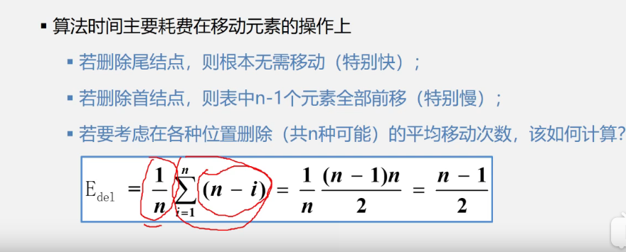
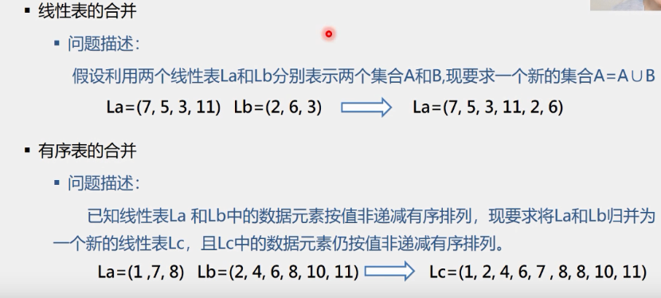

`一、数据基本信息`

`1、数据、数据元素、数据项和数据对象`
  a、数据 
     .是能输入计算机且能被计算机处理的各种符合的集合
       * 信息的载体
       * 是对客观事物符号化的表示
       * 能够被计算机识别、存储和加工
     
     .包括:
       * 数值型的数据：整数、实数等
       * 非数值型的数据：文字、图像、图形、声音等
     
  b、数据元素
     . 是数据的基本单位，在计算机程序中通常作为一个整体进行考虑和处理      
     . 也简称为元素，或称为记录，结点或顶点。 
     . 一个数据元素可由若干数据项组成
     
  c、数据项
     . 构成数据元素的不可分割的最小单位。
     
  d、数据对象
     . 是性质相同的数据元素的集合，是数据的一个子集。   
     
  e、数据类型
     例如C语言中：
      * 提供 int、char、float、double等基本数据类型
      * 数组、结构、共用体、枚举等构造数据类型
      * 还有指针、空（void）类型
      * 用户还可以用typedef来自己定义数据类型  
     
`2、什么是数据结构`
   a、数据元素不是孤立存在的，它们之间存在着某种关系，数据元素相互之间的关系成为结构
   b、是指相互之间存在一种或多种特定关系的数据元素集合
   c、或者说，数据结构是带结构的数据元素的集合
2.1、数据结构包括以下三个方面的内容：
   a、数据元素之间的逻辑关系，也称为逻辑结构
   b、数据元素及其关系在计算机内存中的表示（又称为映像），称为数据的物理结构或数据的存储结构。
   c、数据的运算和实现，即对数据元素可以施加的操作以及这些操作在想要的存储结构上的实现
2.2 数据结构的两个层次
   a.逻辑结构 
     * 描述数据元素之间的逻辑关系
     * 与数据的存储无关，独立于计算机
     * 是从具体问题抽象出来的数学模型
   b.物理结构（存储结构）
     * 数据元素及其关系在计算机存储器中的结构（存储方式）
     * 是数据结构在计算机中的表示
   c.逻辑结构与存储结构的关系
     * 存储结构是逻辑关系的映像与元素本身的映像。
     * 逻辑结构是数据结构的抽象，存储结构是数据结构的实现
     * 两者综合起来建立了数据元素之间的结构关系。    
2.3、逻辑结构的种类
    划分方式一
    1)、线性结构
        有且仅有一个开始和一个终端结点，并且所有结点都最多只有一个直接前趋和一个直接后继
         例如：线性表、栈、队列、串
    2)、非线性结构
        一个结点可能有多个直接前趋和直接后继
         例如：树、图           
    划分方式二
    1)、集合结构：结构中的数据元素之间除了同属于一个集合的关系外，无任何其他关系
    2)、线性几个：结构中的数据元素之间存在一对一的线性关系
    3)、树形结构：结构中的数据元素之间存在着一对多的层次关系
    4)、图状结构或网状结构：结构中的数据元素之间存在着多对的的任意关系。
    
2.4、存储结构的种类
    1)、顺序存储结构
         * 用一组连续的存储单元依次存储数据元素，数据元素之间的逻辑关系由元素的存储位置来表示。
         * C 语言中用数组来实现顺序存储结构
    2)、链式存储结构
        * 用一组任意的存储单元存储数据元素，数据元素之间的逻辑关系用指针来表示。
        * C 语言中用指针（地址）来实现链式存储结构
    3)、索引存储结构
       * 在存储结点信息的同时，还建立附加的索引表。
       * 索引表的每一项称为一个索引项
       * 索引项的一般形式是：（关键字，地址）
       * 关键是能唯一标识一个结点的那些数据项。
    4)、散列存储结构     
       * 根据结点的关键字直接计算出该结点的存储地址
2.5 用C语言实现抽象数据类型
``
 void assign(Complex *A , float real, float image){
   A ->realpart = real; //实部
   A ->imagepart = imag; // 虚部
 }
 
 void add(Complex *c, Complex A, Complex B){
   c -> realpart = A.realpart + B.realpart;
   c -> imagepart = A.imagepart + B.imagepart;
 }
 注:Complex 是我们定义的一个结构类型
  带*：表示指针变量，他是指向Complex类型的指针
  不带*：Complex类型的普通变量
``     
     
2.6、算法
1)、算法的定义：对特定问题求解方法和步骤的一种描述，它是指令的有限序列，其中每个指令表示一个或多个操作     
2)、算法与程序：
   *算法是解决问题的一种方法或一个过程，考虑如何将输入转换成输出，一个问题可以有多种算法
   *程序是用某种程序设计语言对算法的具体实现
3)、算法特性 ：一个算法必须具备以下五个重要特性
  * 有穷性：一个算法必须总是在执行有穷步之后结束，且每一步都在有穷时间内完成
  * 确定性：算法中的每一条指令必须有确切的含义，没有二义性，在任何条件下，只有
       唯一的一条执行路径，即对于相同的输入只能得到相同的输出
  * 可行性： 算法是可执行的，算法描述的操作可以通过已经实现的基本操作执行有限次来实现
  * 输入 ： 一个算法有零个或多个输入
  * 输出 ： 一个算法一个多个多个输出
      
4)、算法设计的要求
  * 正确性（Correctness）
  * 可读性（Readability）
  * 健壮性（Robustness）
  * 高效性（Efficiency）  
  
5)、算法时间复杂度的渐进表示法
  * 为了便于比较不同算法的时间效率，我们仅比较它们的数量级
    例如：两个不同的算法，时间消耗分别是：
      T1(n) = 10n^2 与 T2(n) = 5n^3  
6)、若某个辅助函数f(n),使得当n趋近于无穷大时，T(n)/f(n)的极限值为不等于零的常数，
     则称f(n)是T(n)的同数量级函数。记作T(n) =O(f(n)), 称O(f(n))为算法的渐进时间复杂度(O是数量级的符号)，简称时间复杂度。
 ```
例如：对于求解矩阵相乘问题，算法耗费时间：
        T(n) = 2n^3 + 3n^2 + 2n +1
        当n--->无穷大时，T(n)/n^3 -->2,这表示n充分大时，T(n)与n^3是同阶或同数量级，引入大“O”记号，则T(n)可以记作：
            T(n)= O(n^3)  这就是求解矩阵相乘问题的算法的渐进时间复杂度 

 ```  
7)、 一般情况下，不必计算所有操作的执行次数，而只考虑算法中基本操作执行的次数，它是问题规模n的某个函数，用T(n)表示。
     
8)、算法时间复杂度的定义
    *算法中基本语句重复执行的次数是问题规模n的某个函数f(n),算法的时间量度记作：T(n)=O(f(n))
      a、算法中重复执行次数和算法的执行时间成正比的语句
      b、对算法运行时间的贡献最大的
      c、执行次数最多的     
      
    对应n 越大算法的执行时间越长
     *排序：n为记录数
     *矩阵：n为矩阵的阶数
     *多项式：n为多项式的项数
     *集合：n为元素个数
     *树：n为树的结点个数
     *图：n为图的顶点数或边数
9)、分析算法时间复杂度的基本方法
    a、找出语句频度最大的那条语句作为基本语句
    b、计算基本语句的频度得到问题规模n的某个函数f(n)
    c、取其数量级用符号“O”表示
```
x=0; y=0;
 for(int k=0;k<n;k++){ // for循环是n+1次，循环体是n次
  x++;
}

```

例2：N*N矩阵相乘
   

算法时间复杂度分析示例
   
  
算法时间复杂度分析例题，示例3
   
    
  
10) 渐进空间复杂度
  * 空间复杂度：算法所需存储空间的度量， 记作：S(n)=O(f(n))  其中n为问题的规模(或大小)
  * 算法要占用的空间
     a.算法本身要占据的空间，输入/输出，指令，常数，变量等
     b.算法要使用的辅助空间
     
2.7、知识回顾小结
     1、数据结构 
      a.数据的逻辑结构
          * 线性结构:
              线性表
              栈(特殊线性表)
              队列
              字符串、数组、广义表
          * 非线性结构:
              树形结构
              图形结构   
      b.数据的存储结构
          * 顺序存储
          * 链式存储
      c.数据的运算  
          * 检索、排序、插入、删除、修改等
          
3、线性表要研究的内容
   a.线性表的定义和特点
   b.案例引入
   c.线性的类型定义
   d.线性表的顺序表示和实现2
   e.线性表的链式表示和实现
   f.顺序表和链表的比较
   g.线性表的应用
   h.案例分析与实现
   
3.1线性表的定义和特点
  线性表示具有相同特性的数据元素的一个有限序列 
              
1、线性表(Linear List)
  
   
3.2、案例引入
 案例:一元多项式的运算，实现两个多项式加、减、乘运算  
 
 
 稀疏多项式:存储是就不根据上面的方法来存储了，因为按照那种方式存储会操作空间浪费
  
 稀疏多项式的运算
 
 注意: 稀疏多项式运算
      1、创建一个新的数组c
      2、分别从头遍历比较a和b的每一项
         *指数相同，对应系数相加，若相加不为零，则在c中增加一个新项
         *指数不相同，则将指数较小的项复制到c中
         
 顺序存储结构存在问题
   1、存储空间分配不灵活
   2、运算的空间复杂度高
   
3.3、线性的类型定义
  1、抽象数据类型线性表的定义如下：
   
  2、InitList(&L) (Initialization List)
   操作结果:构造一个空的线性表L
  3、DestroyList(&L)
   * 初始条件:线性表L已经存在
   * 操作结果:销毁线性表
  4、ClearList(&L)
   * 初始条件:线性表L已经存在。
   * 操作结果:将线性表L重置为空表。
  5、ListEmpty(L)
   * 初始条件:线性表L已经存在。
   * 操作结果:若线性表L为空表,则返回TRUE;否则返回FALSE。     
  6、ListLength(L)
   * 初始条件:线性表L已经存在。
   * 操作结果:返回线性表L中的数据元素个数。  
  7、GetElem(L,i,&e)  (加上&表示要返回值)
   * 初始条件:线性表L已经存在,1<=i<=ListLength(l)。
   * 操作结果:用e返回线性表L中第1个数据元素的值。
  8、LocateElem(L,e,compare())
   * 初始条件:线性表L已经存在,compare()是数据元素判定函数。
   * 操作结果:返回L中第1个与e满足compare的数据元素的位序,若这样的数据元素不存在则返回值为0。
  9、PriorElem(L,cur_e,&pre_e)
   * 初始条件:线性表L已经存在。
   * 操作结果:若cur_e是L的数据元素,且不是第1个，则用pre_e返回它的前趋否则操作失败,pre_e无意义。  
  9、NextElem(L,cur_e,&next_e)
    * 初始条件:线性表L已经存在。
    * 操作结果:若cur_e是L的数据元素,且不是最后一个，则用next_e返回它的后继否则操作失败,next_e无意义。
  10、ListInsert(&L,i,e)
     * 初始条件:线性表L已经存在,1<=i<=ListLength(L)+1。
     * 操作结果:在L的第i个位置之前插入新的数据元素e,L的长度加1   
  11、ListDelete(&L,i,&e)
      * 初始条件:线性表L已经存在,1<=i<=ListLength(L)。
      * 操作结果:删除L的第i个数据元素,并用e返回其值,L的长度减一。   
  12、ListTraverse(&L,visited())
       * 初始条件:线性表L已经存在。
       * 操作结果:依次对线性表中每个元素调用visited()。   
 
3.4、线性表的顺序存储表示
   线程表的顺序表示又称为顺序存储结构或顺序映像
   a、顺序存储定义:把逻辑上相邻的数据元素存储在物理上相邻的存储单元中的存储结构


3.4.1、顺序表的顺序存储表示

 定义多项式的结构，然后去计算多项式。


3.5 补充 类c语言的有关操作
 a、对一些问题的补充说明
                                        
 
 b、C语言的内存动态分配
  (Sequence List) 顺序表，下面的SqList L 定义变量，L是SqList这种类型的。
  这个就像 int a; //定义变量a, a是int型。
  SqList L;
   L.data=(ElemType*)malloc(sizeof(ElemType)*MaxSize);  
   这里ElemType*, *表示指针 这里进行了强制类型转换。
  1)、malloc(m)函数，开辟m字节长度的地址空间，并返回这段空间的首地址, 参数要求是整数
  2)、sizeof(x)运算，计算变量x的长度
  3)、free(p)函数，释放指针p所指变量的存储空间，即彻底删除一个变量
  
  这些函数在头文件里面，所以需要加载头文件:<stdlib.h>  
 
3.5.1 C++中参数传递
  1、函数调用时传送给形参表的实参必须与形参三个一致 
     类型、个数、顺序
  2、参数传递有两种方式
     * 传值方式(参数为整型、实型，字符型等)
     * 传地址
         参数为指针变量
         参数为引用类型
         参数为数组名 
         
 a、传值方式:把实参的值传送给函数局部工作区相应的副本中，函数使用这个副本执行必要的功能。
  函数修改的是副本的值，实参的值不变。
  
  
b、传地址方式---指针变量作为参数
  * 形参变化影响实参
    这个指针指向的就是这个参数地址位置
   这里方式是改变指针指向的内容

 
  *形参变化不影响实参??
   这里只是改变指向，但是不改变指针指向的地址
 
    
    
c、传地址方式--数组名作为参数
  *传递的是数组的首地址
  *对形参数组所做的任何改变都将反映到实参数组中

d、传地址方式-- 引用类型做参数
  引用:它用来给一个对象提供一个替代的名字
```
#include<iostream.h>
void main(){
   int i=5;
   int &j=i;
   i=7;
   count<<"i="<<i<<" j="<<j;
}

这里j是一个引用类型，代表i的一个替代名i值改变是，j值也跟着改变，所以会输出i=7 j=7

```       

e、引用类型作为形参的三点说明
 (1).传递引用给函数与传递指针的效果是一样的，形参变化实参也发生变化
 (2).引用类型作参数，在内存中并没有产生实参的副本，它直接对实参操作;
    而一般变量作参数，形参与实参就占用不同的存储单元，所以形参变量的值是实参变量的副本。
    因此，当参数传递的数据量较大时，用引用比用一般变量传递参数的时间和空间效率都好    
 (3).指针参数虽然也能达到与使用引用的效果，但在被调用函数中需要重复使用
   "*指针变量名(取这个指针变量的内容)"的形式进行运算，这很容易产生错误且程序的阅读性较差;另一方面，
   在主调函数的调用点处，必须用变量的地址作为实参。    
   
3.6线性表的顺序表示和实现
  顺序表示意图
    
  
补充:操作算法中用到的预定义常量和类型
```
//函数结果状态代码
#define TRUE  1
#define FALSE 0
#define OK    1 
#define ERROE 0
#define INFEASIBLE -1
#define OVERFLOW   -2
//Status 是函数类型，其值是函数结果状态代码
typedef int Status;
typedef char ElemType;
```   
3.6.1 顺序表基本操作的实现
 【算法2.1】 线性表L的初始化(参数用引用类型)
```
 //这里参数应的是引用型的，也就是说这里对形参进行操作实际上也对实参进行了操作
 Status InitList_Sq(SqList &L){ // 构造一个空的顺序表L
  L.elem = new ElemType[MAXSIZE]; // 为顺序表发分配空间
  if(!L.elem) exit(OVERFLOW);  //存储分配失败
  L.length=0;                  //空表长度为0
  return OK; 
}
```             
3.7 顺序表上的查找操作
  a.按值查找:按照给定的运算进行查找,从头到尾一个一个的查找
  算法示例: 
  
  
  b. 平均查找长度ASL(Average Search Length)
     *为确定记录在表中的位置，需要与给定值进行比较的关键字的个数的期望值叫做查找算法的凭据查找长度
   平均查找长度公式:  这个公式中大E是累加和，P表示第i个记录被查询的概率
     C表示第i个记录需比较的次数。
     
    
   公式的推导:每个元素的概率提取出来，然后在进行元素相加，这个是等差数列求和。所以最终的公式如图
   
             
3.8、插入算法如果在顺序表上表现出来
 顺序表的插入
 
 算法的实现
 注意：这里的i是位序，不是数组下标
 ``` 
 Status ListInsert_Sq(SqList &L,int i,ElemType e){ // 构造一个空的顺序表L
  if(i<1 || i>L.length+1) return ERROR; //i值不合法 
  if(L.length == MAXSIZE) return ERROR;  //当前存储空间已满
  for(j=L.length-1;j>=i-1;j--){
   L.elem[j+1]=L.elem[j]; //插入位置及之后的元素后移
  }
   L.elem[i-1] = e;      //将新元素e放入第i个位置
   L.length++;           //表长增加1
   return OK;
   
 }
```
算法时间主要耗费在移动元素的操作上
 * 若插入在尾结点之后，则根本无需移动(特别快);
 * 若插入在首结点之前，则表中元素全部后移(特别慢);
 * 若要考虑在各种位置插入(共n+1中可能)的平均移动次数，该如何计算?
 
 *顺序表插入算法的平均时间复杂度为O(n)
 
3.9、顺序表的删除算法。 
 算法时间主要耗费在移动元素的操作上
 * 若删除尾结点之后，则根本无需移动(特别快);
 * 若删除在首结点之前，则表中元素全部后移(特别慢);
 * 若要考虑在各种位置删除(共n中可能)的平均移动次数，该如何计算?
 
 *其中中1/n 表示每个元素的出现的概率，而(n-i)表示每个元素需要移动多少次。然后将积数和求出来，其实就是等差数列
  *顺序表删除算法的平均时间复杂度为O(n) 
         
3.10 顺序表(线性表的顺序存储结构)的特点 
 (1)、利用数据元素的存储位置表示线性表相邻数据元素直接的前后关系，即线性表的逻辑结构与存储结构一致
 (2)、在访问线性表时，可以快速地计算任何一个数据元素的存储地址。因此可以粗略的认为访问每个元素所花时间相等。
    *这种存储元素的方法被称为随机存取法 
 (3)优点：
    a.存储密度大(结点本身所占存储量/结点结构所占存储量)
    b.可以随机存取表中任一元素
 (4)缺点：
   a.在插入、删除某一个元素时，需要移动大量元素
   b.浪费存储空间
   c.属于静态存储形式，数据元素的个数不能自由扩充
                
4.0 线性表的链式存储 
   链式存储结构特点：
     a.结点在存储器中的位置是任意的，即逻辑上相邻的数据元素在物理上不一定相邻。
     b.访问时只能通过头指针进入链表，并通过每个结点的指针域依次向后顺序扫描其余结点，
        所以寻找第一个结点和最后一个结点所花费的时间不等。
          这种存储元素的方法被称为"顺序存取法"
     
  (1)、单链表是由头指针唯一确定，因此单链表可以用头指针的名字来命名。 
           最后一个元素如果后面没有了那么使用NUll表示没有元素了，这个空在计算机内部存储的是0。
  (2)、与链式存储有关的术语
     a.结点：数据元素的存储映像。由数据域和指针域两部分组成
     b.链表：n个结点由指针链组成一个链表。 它是线性表的链式存储映像，称为线性表的链式存储结构

  (3)、单链表、双链表、循环链表:
     a.结点只有一个指针域的链表，称为单链表或线性链表
     b.结点有两个指针域的链表，称为双链表 ，一个指向前驱，一个指向后继结点，还有一个数据域。
     c.首尾相接的链表称为循环链表              
    
    
  (4)、头指针、头结点和首结点 ,头结点是附加的，而这个带头结点的链表中往往不是存储第一个元素的，而是我们额外附加的结点。
    
  (5)、讨论1:如何表示空表?  使用^表示空
   
  (6)、讨论2:在链表中设置头结点有什么好处?
      a、便于首元结点的处理
          首元结点的地址保存在头结点的指针域中,所以在链表的第一个位置的操作和其它位置一致，无须进行特殊处理；
      b、便于空表和非空表的统一处理
          无论链表是否为空，头指针都是指向头结点的非空指针，因此空表和非空表的处理也就统一了。
  (7)、讨论3:头结点的数据域内装的是什么？
      头结点的数据域可以为空，也可以存放线性表长度等附加信息，但此结点不能计入链表长度值。
    
4.1、线性表的链式存储结构2 
    a. 单链表的存储结构
      
    b.定义单链表的存储结构
     
    c.示例
     
      通常常用下的这种定义
     
     
4.2、线性表的链式存储结构3
(1)、单链表的初始化(带头结点的单链表)
     .即构造一个如图的空表
   【算法步骤】
      a.生成新结点作头结点，用头指向L指向头结点。
      b.将头结点的指针域置空
   【算法描述】
      Status InitList_L(LinkList &L){
       //从内存中申请一个空间，然后获取这个空间的地址赋值给L
       L = new LNode; // 或L=(LinkList)malloc(sizeof(LNode));
       L->next = NULL;
       return OK;
      }       
      
   
   
(2)、补充单链表的几个常用简单算法
 a.【补充算法1】-----判断链表是否为空
      空表:链表中无元素，称为空链表(头指针和头结点仍然在)
    ```
    【算法思路】判断头结点指针域是否为空
       int ListEmpty(LinkList L){
             if(L->next) //非空
              return 0;
             else
              return 1; 
           } 
    ``` 
 b.【补充算法2】----单链表的销毁，链表销毁后不存在
        
```
Status DestroyList_L(LinkList &L){//销毁单链表L
   Lnode *p; // 或LinkList p;
   while(L){
    p=L;
    L=L->next;
    delete p;
   }
 }
```    
c.补充算法3----清空链表;
  链表仍存在,但链表中无元素，成为空链表(头指针和头结点仍然在)     
 【算法思路】依次释放所有结点，并将头结点指针域设置为空  
  
```
Status ClearList_L(LinkList &L){//将L重置为空表
   //有时候是L, 有时候是&L, 这里说明下:&L是将表用L返回，如果不返回是，就不用&
   Lnode *p,*q; // 或LinkList p,q;
   p = L->next;
   while(p){
    q=p->next; 
    delete p;
    p=q;
   }
   L->next=NUll; //头结点指针域为空
   return OK;  
 }
```  
d.补充算法4----求单链表的表长;
 ```
 Status Listlength_L(LinkList L){//返回L中数据元素个数
    //有时候是L, 有时候是&L, 这里说明下:&L是将表用L返回，如果不返回是，就不用&
    Lnode p; // 或LinkList p,q;
    p = L->next;  // p指向第一个结点
    i=0;
    while(p){
     i++;
     p=p->next; 
    }
    return i;  
  }
 ```
  
4.3 知识回顾
 (1)、类型定义
```
typedef struct LNode
{
    ElemType data;
    struct LNode *next; // 指针，它是指向一个同样式这个结点类型的一个指针，存放的是一个地址
    //*LinkList 表示指向结构体Lnode的指针类型
}LNode, *LinkList; // 重新定义了类型名，一个是这个结点的LNode,一个是指向这个结点的LinkList

```
(2)、变量定义
```
LinkList L; //因为LinkList本身就是一个指针型，所以L前面不用加上*号。
LNode *p,*s; //存储结点地址的指针呢，就用LNode来声明。LNode来声明是指向这种结点的指针 所以p前面需要加*号。
  *p,*s都是用来指向这种类型结点的指针。
```
(3)、重要操作
```
p=L; //p指向头结点
s=L->next;//s指向首元结点
p=p->next;//p指向下一结点

```

(4)、类C语言实现 元素i查找
 ```
 Status GetElem_L(LinkList L,int i, ElemType &e){//获取线性表中的某个数据元素的内容，通过变量e返回
    p = L->next;j=1;  // 初始化
    while(p && j<i){//向后扫描，直到p指向第i个元素或p为空
     p=p->next;++j; 
    }
    if(!p||j>i) return ERROR; //第i个元素不存在
    e=p->data;    //取第i个元素
    return OK;  
  } //GetElem_L
 ```
(5)、按值查找---根据指定数据获取该数据所在的位置(地址)
   算法步骤
    a.从第一个结点起,依次和e相比较。
    b.如果找到一个其值与e相等的数据元素，则返回其在链表中 "位置" 或者 地址。
    c.如果查遍整个链表都没有找到其值和e相等的元素,则返回 0 或者"NULL"。
//按值查找 ，返回地址
 ```
  Lnode *LocateElem_L(LinkList L, ElemType e){
     //在线性表L中查找值为e的数据元素
     // 找到,则返回L中值为e的数据元素的地址,查找失败返回NULL
     p = L->next;
     // p不为空 并且 p->data和e不想等那么就继续查询
     while(p && p->data!=e){
      p=p->next; 
     }
     return p;  
   } 
  ``` 
//按值查找 ，返回位置序号
 ```
 //在线性表L中查找值为e的数据元素的位置序号
  int LocateElem_L(LinkList L,ElemType e){
     // 返回L中值为e的数据元素的位置序号,查找失败返回0
     p = L->next; j=1; //j记录位置
     // 当前p值不为空 并且 p->data和e值不想等那么就继续查询
     while(p && p->data!=e){
      p=p->next;   
      j++;
     }
     if(p){ 
       return j;
     }else{
       return 0;  
     }
   } 
  ``` 
(6)、插入---在第i个结点签插入值为e的新节点 
   a.首先找到i-1的存储位置p。
   b.生成一个数据域为e的新结点s。
   c.插入新结点： (1)新结点的指针域指向结点i
                  (2)结点i-1的指针域指向新结点
    
示例代码
 ```
 //在线性表L中第i个元素之前插入数据元素e
  Status ListInsert_L(LinkList &L,int i,ElemType e){
     // 返回L中值为e的数据元素的位置序号,查找失败返回0
     p = L->next; j=0; //j记录位置
     // 当前p值不为空 并且 p->data和e值不想等那么就继续查询
     while(p && j<i-1){ // 寻找第i-1个结点，p指向i-1结点
      p=p->next;   
      ++j;
     }
     if(!p || j>i-1){ 
       return ERROR; //i大于表长+1或者小于1,插入位置非法
     }
     s = new LNode; s->data=e; //生成新结点s,将结点s的数据域置为e
     s->next = p->next;    // 将结点s插入L中,先将第i个结点放在新结点的后面 作为新结点的后继
     p->next = s;          // 然后再把这个新结点 接到i-1这个结点的后面
     return OK;
   } 
  ```    
(7)、删除---删除第i个结点
    算法步骤: 
      a.首先找到i-1的存储位置p,保存要删除的i的值。
      b.令p->next指向i+1。 
      c.释放结点i的空间。
  
示例代码
 ```
 //将线性表L中第i个数据元素删除
  Status ListDelete_L(LinkList &L,int i,ElemType &e){
     p = L; j=0; q=i; //j记录位置
     //从头往后进行查找 ，并且用计数器数着 是否到i-1个位置。如果不是那么再次循环
     while(p->next && j<i-1){ // 寻找第i个结点，并令p指向前趋
      p=p->next;   
      ++j;
     }
     if(!(p->next) || j>i-1){ //当数据元素在1~n之间,如果查找到n之后,那么指针 p->next就为空了 
       return ERROR; //不合理位置报错
     }
     q=p->next;           // 临时保存被删除结点的地址以备释放
     p->next = q->next;   // 改变删除结点前趋结点的指针
     e=q->data;           // 保存被删除结点的数据域
     delete q;            //释放删除结点的空间
     return OK;
   } 
  ```      
(8)、单链表的查找、插入、删除的时间效率
    a.查找
      *因线性链表只能顺序存取,即在查找是要从头指针找起,查找的时间复杂度为O(n)
    b.插入和删除
      *因线性链表不需要移动元素,只要修改指针,一般情况下时间复杂度为O(1)
      *但是,如果要在单链表中进行前插或删除操作,由于要从头查找前趋结点,所耗时间复杂度为O(n)
      
(9)、单链表的建立
    1.头插法----元素插入在链表头部，也叫前插法
      a.从一个空表开始,重复读入数据;
      b.生成新结点,将读入数据存放到新结点的数据域中
      c.从最后 一个结点开始,依次将各结点插入到链表的前端
 示例图;     
      
 
 2.在内存中申请一个地址，然查找到这个空间 然后将空间地址赋值给L
  L = new LNode;// C++申请地址
  L=(LinkList)malloc(sizeof(LNode));//c语言方式，使用malloc分配函数来分配一个结点这么大的空间
 示例图:
 
 算法实现
```
 //倒位序输入元素
  void CreateList_H(LinkList &L,int n){
     L =new LNode;
     L->next=NULL;//先建立一个带头结点的单链表 
     for(i=n;i>0;--i){
      p=new LNode; // 生成新结点p=(LNode*)malloc(sizeof(LNode));
      cin>>p->data; //输入元素值 前面的是c++写法, 后面的 scanf(&p->data) 是c语言写法;  
      p->next=L->next; //插入到表头
      L->next = p;
     }
   } 
算法时间复杂度是:O(n)
  ```       
 

(9.1)、尾插法------元素插入到链表尾部,也叫后插法
   a.从一个空表L开始,将新结点逐个插入到链表的尾部，尾指针r执行链表的尾结点。
   b.初始时,r同L均指向头结点 。没读入一个数据元素则申请一个新结点,将新结点插入到尾结点后,r指向新结点。
 算法实现
```
  //正未序输入n个元素的值，建立带表头结点的单链表L
  void CreateList_H(LinkList &L,int n){
     L =new LNode;
     L->next=NULL;//先建立一个带头结点的单链表 
     r=L; //尾指针r指向头结点
     for(i=n;i>0;++i){
      p=new LNode; // 生成新结点，输入元素,指针变量p指向这个空间
                   // p=(LNode*)malloc(sizeof(LNode));
      cin>>p->data; //输入元素值  前面的是c++写法, 后面的 scanf(&p->data) 是c语言写法;  
      p->next=NULL;
      r->next=p; //插入到表尾
      r = p; //r指向新的尾结点
     }
   } //CreateList_R
算法时间复杂度是:O(n)
  ```
4.4 线性表的链式表示和实现--循环链表
  (1)、 循环链表:是一种头尾相接的链表(即:表中最后一个结点的指针域指向头结点,整个链表形成一个环)
   优点:从表中任一结点出发均可找到表中其他结点   
   
   注意:由于循环链表中没有NULL指针,故涉及遍历操作时,其终止条件就不再像非循环链表那样判断
   p或p->next是否为空,而是判断它们是否等于头指针。
   
   循环条件:
```
 p!=NULL                   p!=L (不等于头指针)
 p->next!=NULL             p->next!=L
 单链表                    单循环链表
```
(2)、头指针表示   找a1的复杂度:O(1)
单循环链表   找an的复杂度:O(n) 
注意:表的操作常常是在表的首尾位置上进行

(3)、尾指针表示   找a1的存储位置是: R->next->next    时间复杂度都是O(1)
单循环链表   找an的存储位置是: R
示意图:


(4)、合并两个单循环链表

```
  LinkList Connect(LinkList Ta,LinkList Tb){
     //假设Ta、Tb都是非空的单循环链表
     p = Ta->next;            // p存表头结点
     Ta->next=Tb->next->next; // Tb表头连结Ta表尾
     delete Tb->next;         // 释放Tb表头结点 或free(Tb->next);
     Tb->next=p;              // 修改指针
     return Tb;
   } //CreateList_R
算法时间复杂度是:O(n)
  ```

4.5 线性表的链式表示和实现--双向链表
 单链表: 单链表的结点 -->有指示后继的指针域-->找后继结点方便； 
       即:查找某结点的后继结点的执行时间为O(1).
       无指示前驱的指针域--->找前驱结点难:要从表头出发开始查找
       即:查找某结点的前驱结点的执行时间为O(n)
 双向链表:在单链表的每个结点里面再增加一个指向其直接前驱的指针域prior, 
      这样链表中就形成了有两个方向不同的链表,故称为双向链表。(可以用双向链表来克服单链表查找前驱结点的缺点)    


(1)、双向链表的结构可定义如下
```
typedef struct DuLNode
{
    ElemType data;
    struct DuLNode *prior *next; // 指针，它是指向一个同样式这个结点类型的一个指针，存放的是一个地址
    //*LinkList 表示指向结构体Lnode的指针类型
}DuLNode, *DuLinkList; // 重新定义了类型名，一个是这个结点的LNode,一个是指向这个结点的LinkList

```


(3)、双向循环链表
   和单链表的循环表类似，双向链表也可以有循环表
   *让头结点的前驱指针指向链表的最后一个结点
   *让最后一个结点的后继指针指向头结点
  
  
(4)、双向链表结构的对称性(设指针p指向某一结点)
   p->prior->next = p = p-> next ->prior
  在双向链表中有些操作(如:ListLength, GetElem等),因仅涉及一个方向的指针,
  故它们的算法与线性链表的相同。但在插入、删除时,则需要同时修改两个方向上的指针,
  两者的操作的时间复杂度为O(n) 
  
  
  
(5)、双向链表的插入 
插入示意图:
 
 
算法实现:
```
  //头结点的指针 &L, 插入一个元素后仍然用这个返回，所以前面带了连字符& 引用型变量
  void ListInsert_DuL(DuLinkList &L,int i, ElemType e){
     //在带头结点的双向循环链表L中第i个位置之前插入元素e
     //在链表L上找到第i个，找到结果后赋值个p,让p指向第i个结点
     //如果位置是不合理的 那么就返回错误。
    if(!(p=GetElemP_Dul(L,i))) return RRROR;
     s=new DuLNode;  
     s->data=e;
     s->prior=p->prior; //1 p->prior表示的是前驱结点, 是存的前驱结点的地址 
     p->prior->next =s; //2 p->prior->next 表示前驱结点的地址，然后再根据这个查找next 就表示后继
     s->next = p;       //3
     p->prior=s;        //4
     return OK; 
   } //ListInsert_DuL
  ```

(6)、双向链表的删除 
删除示意图:
 
 
算法实现:
```
  //头结点的指针 &L, 插入一个元素后仍然用这个返回，所以前面带了连字符& 引用型变量
  void ListDelete_DuL(DuLink &L,int i, ElemType &e){
     //删除带头结点的双向循环链表L的第i个元素,并用e返回。
    if(!(p=GetElemP_Dul(L,i))) return RRROR;
     e = p->data;
     p->prior->next = p->next; 
     p->next->prior = p->prior;      
     free(p)
     return OK; 
   } //ListDelete_DuL
  ```  


(7)、单链表、循环链表和双向链表的时间效率比较 


4.6 顺序表和链式的比较
 (1)、链式存储结构的优点
    * 结点空间可以动态申请和释放
    * 数据元素的逻辑次序靠结点的指针来指示,插入和删除时不需要移动数据元素
 (2)、链式存储结构的缺点
    * 存储密度小,每个结点的指针域需要额外占用存储空间。当每个结点的数据域所占字节不多时，
       指针域所占存储空间的比重显得很大
      存储密度计算方法如图:  
     
    * 链式存储结构是非随机存取结构。对任一结点的操作都要从头指针依指针链查找到该结点，
      这增加了算法的复杂度。
 (3)、比较图
   
  
4.7 线性表的应用
 (1)、问题描述
    * 假设利用两个线性表La和Lb分别表示两个集合A和B,现要求一个新的集合A=A 并集 B(
      La=(7,5,3,11) Lb=(2,6,3) ====> La=(7,5,3,11,2,6)
 (2)、有序表的合并
    问题描述:
       已知线性表La和Lb中的数据元素按值非递减有序排列,现要求将La和Lb归并为一个新的线性表Lc,
       且Lc中的数据元素仍按值非递减有序排列。
       La=(1,7,8) Lb=(2,4,6,8,10,11) ====> Lc=(1,2,4,6,7,8,8,10,11)        
         
 
 (3)、第一个问题 两个线性表集合求并集 实现
   a.简单实现步骤: 依次取出Lb集合中的每一个元素, 执行以下操作
      * 在La中查该元素是否存在
      * 如果没有找到,那么就将其插入到La的最后
```
  //头结点的指针 &L, 插入一个元素后仍然用这个返回，所以前面带了连字符& 引用型变量
  void unio(List &La,list &Lb){
    La_len = ListLength(La);
    Lb_len = ListLength(Lb);
    for(i=1;i<=Lb_len;i++){
      GetElem(Lb,i,e);
        if(!LocateElem(La,e))  
         ListInsert(&La,++La_len,e);
     }
   } //ListDelete_DuL
  ```  
图示:


(4)、第二个问题 有序表的合并 实现：
  算法步骤：
    a.创建一个空表Lc
    b.依次从La或Lb中"摘取"元素值较小的结点插入到Lc表的最后，直至其中一个表边空位为止
    c.继续将La或Lb其中一个表的剩余结点插入在Lc表的最后

1.用顺序表实现 (也就是数组)    
 ```
   void MergeList_Sq(SqList LA, SqList LB, SqList &LC){
     pa = LA.elem;
     pb = LB.elem;      //指针pa和pb的初值分别指向两个表的第一个元素
     LC.length = LA.length+LB.length;     //新表长度待合并两表的长度之和
     LC.elem = new ElemType[LC.length];   //为合并后新表分配一个数组空间
     pc = LC.elem;                         //指针pc指向新表的第一个元素
     //怎么知道没有元素了呢?那么就是在最后一个元素加进去就没有了。
     // 那pa_last怎么得到呢? 那么就是基地址+ 长度减一 就是最后一个元素的地址
     pa_last = LA.elem + LA.length-1;      // 指针pa_last指向LB表的最后一个元素
     pb_last = LB.elem + LB.length-1;      // 指针pb_last指向LB表的最后一个元素
     
     while(pa<pa_last && pb<pb_last){  //两个表都非空
        if(*pa <= *pb) {
          *pc++=*pa++;                //依次"摘取" 两表中值较小的结点
        }else{
          *pc++=*pb++; 
        }
     }

     while(pa<=pa_last){
       *pc++=*pa++;  //LB表已达到表尾，将LA中剩余元素加入到LC中
     }
     while(pb<=pb_last){
            *pc++=*pb++;  //LA表已达到表尾，将LB中剩余元素加入到LC中
     }

    } //MergeList_Sq
   ```
算法图示:


2.用链表表实现合并

 移动指针pa,  这里pa指针来操作La中结点，pb指针来操作Lb中的结点，pc指针来操作Lc中的结点

当Lb中元素小于La中的 data域，那么将小的那个加入到lc当做去

也是重复操作，判断是否那个小，然后将小的加入到Lc中，

如果当pa指针 为空时，这就表示一个链表已经全部加入到 一个新的链表中去了，那么没有元素就不管了，只是将还有元素的链表加入到新的链表中去

合并之后


链表算法实现：
```
   void MergeList_Sq(LinkList &La, LinkList &Lb, LinkList &Lc){
     pa = La->next;
     pb = Lb->next;      
     pc=Lc=La;     //用La的头结点作为Lc的头结点

     while(pa && pb){  
        if(pa ->data<=pb->data) {
          pc->next=pa;
          pc=pa;
          pa=pa->next;
        }else{
          pc->next=pb;
          pc=pb;
          pb=pb->next; 
        }
     }
     pc->next=pa?pa:pb; //插入剩余段
     delete Lb; //释放Lb的头结点    
    } //MergeList_Sq
   ```


4.8 案例分析和实现
(1)一元多项式计算
使用数组来表示：
多项式的指数表示数组的下标， 然后存储值用系数表示


使用数组存储，因为都是相同指数来表示，所以多项式相加就是将数组相同下标进行相加


(2) 稀疏多项式的运算
多项式非零项的数组表示
      比如 (a).A(x) = 7+3X+9X^8 + 5X^17
表示方式：
       下标i:  0, 1, 2, 3
      系数a[i]:7, 3, 9, 5
      指数：   0, 1, 8, 17
      
使用线性表来表示:
  线性表A=((7,0),(3,1),(9,8),(5,17))
图示：


示例：   
 线性表A=((7,0),(3,1),(9,8),(5,17))
 线性表B=((8,1),(22,7),(-9,8))
*创建一个新数组c
*分别从头遍历比较a和b的每一项
   a.如果指数相同,对应系数相加,若其和不为零,则在c中增加一个新项
   b.如果指数不相同,则将指数较小的复制到c中  
*一个多项式已遍历完毕时,将另一个剩余项依次复制到c中即可
   数组大小不好确定
        